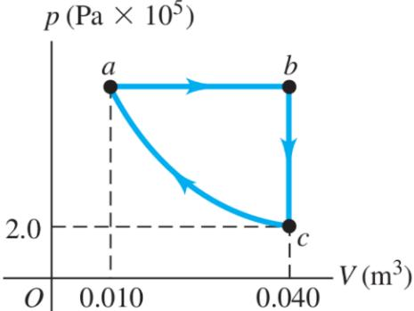
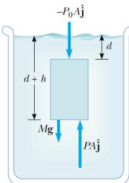
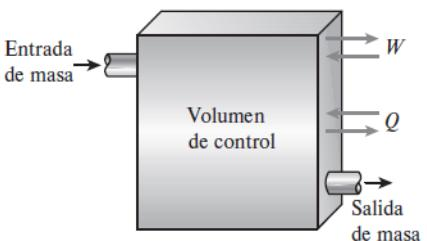

## Termodinámica, 1-2025

Versión del 13 de mayo de 2025

## Prefacio

Estos apuntes están en construcción para el curso de termodinámica (FIS1523) en la PUC (1-2025). Es por esto que hay diversas partes inconclusas o que faltan algunas cosas. Estas notas no pretenden reemplazar las clases y solo deben usarse como material complementario.

Es muy probable que existen diversos errores.

## Índice general

|     | Prefacio I         |                                                     |          |     |     |     |     |     |     |     |     |     |
| --- | --------------------- | --------------------------------------------------- | -------- | --- | --- | --- | --- | --- | --- | --- | --- | --- |
| 1.  |                       | Introducción y Ley cero de la termodinámica.        | 2        |     |     |     |     |     |     |     |     |     |
|     | 1.1.                  | Introducción                                     | 2        |     |     |     |     |     |     |     |     |     |
|     | 1.2.                  | Definiciones e ideas fundamentales:              | 2        |     |     |     |     |     |     |     |     |     |
|     |                       | 1.2.1. Sistema y su entorno                   | 2        |     |     |     |     |     |     |     |     |     |
|     |                       | 1.2.2. Medio Continuo                         | 4        |     |     |     |     |     |     |     |     |     |
|     |                       | 1.2.3. Estado y proceso Termodinamico         | 4        |     |     |     |     |     |     |     |     |     |
|     | 1.3.                  | Presión                                          | 5        |     |     |     |     |     |     |     |     |     |
|     |                       | 1.3.1. Manómetro                              | 7        |     |     |     |     |     |     |     |     |     |
|     | 1.4.                  | Temperatura y Ley cero                           | 7        |     |     |     |     |     |     |     |     |     |
|     |                       | 1.4.1. Ley cero de termodinámica              | 8        |     |     |     |     |     |     |     |     |     |
|     |                       | 1.4.2. Temperatura                            | 8        |     |     |     |     |     |     |     |     |     |
|     |                       | 1.4.3. Termómetro de gas a Volumen constante  | 8        |     |     |     |     |     |     |     |     |     |
|     |                       | 1.4.4. Escala Celsius y Kelvin                | 9        |     |     |     |     |     |     |     |     |     |
|     | 1.5.                  | Expansión termica de solidos y liquidos          | 9        |     |     |     |     |     |     |     |     |     |
|     |                       | 1.5.1. Comportamiento anómalo del agua        | 10       |     |     |     |     |     |     |     |     |     |
|     | 1.6.                  | Ejemplos Resueltos                               | 10       |     |     |     |     |     |     |     |     |     |
| 2.  | Energía y Calor 14 |                                                     |          |     |     |     |     |     |     |     |     |     |
|     | 2.1.                  | Formas de energía                                | 14       |     |     |     |     |     |     |     |     |     |
|     |                       | 2.1.1. Energía Mecánica                       | 15       |     |     |     |     |     |     |     |     |     |
|     | 2.2.                  | Transferencia de energía                         | 15       |     |     |     |     |     |     |     |     |     |
|     | 2.3.                  | Transferencia de energía por calor               | 16       |     |     |     |     |     |     |     |     |     |
|     |                       | 2.3.1. Mecanismos de transferencia de calor   | 17       |     |     |     |     |     |     |     |     |     |
|     | 2.4.                  | Forma Mecánica del trabajo                       | 19       |     |     |     |     |     |     |     |     |     |
|     |                       | 2.4.1. Trabajo del Resorte                    | 19       |     |     |     |     |     |     |     |     |     |
|     |                       | 2.4.2. Trabajo de Flecha                      | 19       |     |     |     |     |     |     |     |     |     |
|     | 2.5.                  | Transferencia de energía por trabajo             | 20       |     |     |     |     |     |     |     |     |     |
|     | 2.6.                  | Primera Ley de Termodinámica                     |          |     |     |     |     |     |     |     |     |     |
|     | 2.7.                  | Ejemplos                                         | 21 23 |     |     |     |     |     |     |     |     |     |
|     | 2.8.                  | Problemas propuestos                             | 27       |     |     |     |     |     |     |     |     |     |

| 3.  | Sustancias puras                |                                                                      |          |     |     |     |     |     |     |     |     |     |
| --- | ------------------------------- | -------------------------------------------------------------------- | -------- | --- | --- | --- | --- | --- | --- | --- | --- | --- |
|     | 3.1.                            | Tipos de sustancias                                               | 28       |     |     |     |     |     |     |     |     |     |
|     | 3.2.                            | Fases de una Sustancia Pura                                       | 28       |     |     |     |     |     |     |     |     |     |
|     |                                 | 3.2.1. Cambios de Fase en sustancias puras.                    | 28       |     |     |     |     |     |     |     |     |     |
|     |                                 | 3.2.2. Diagrama T-ν                                         | 29       |     |     |     |     |     |     |     |     |     |
|     |                                 | 3.2.3. Diagrama P−v                                         | 31       |     |     |     |     |     |     |     |     |     |
|     |                                 | 3.2.4. Incluyendo Solidos                                      | 31       |     |     |     |     |     |     |     |     |     |
|     |                                 | 3.2.5. La superficie P-V-T                                     | 32       |     |     |     |     |     |     |     |     |     |
|     | 3.3.                            | Tablas de Propiedades                                             | 33       |     |     |     |     |     |     |     |     |     |
|     |                                 | 3.3.1. Estados de liquido Saturado y Vapor Saturado            | 34       |     |     |     |     |     |     |     |     |     |
|     |                                 | 3.3.2. Mezcla de liquido-gas saturado                          | 36       |     |     |     |     |     |     |     |     |     |
|     |                                 | 3.3.3. Vapor Sobrecalentado                                    | 40       |     |     |     |     |     |     |     |     |     |
|     | 3.4.                            | Liquido Comprimido                                                | 41       |     |     |     |     |     |     |     |     |     |
|     | 3.5.                            | Sustancias y gases ideales                                        | 41       |     |     |     |     |     |     |     |     |     |
| 4.  |                                 | Analisis de energias de sistemas cerrados                            | 46       |     |     |     |     |     |     |     |     |     |
|     | 4.1.                            | Trabajo hecho por una frontera móvil                              | 46       |     |     |     |     |     |     |     |     |     |
|     |                                 | 4.1.1. Proceso Politropico                                     | 47       |     |     |     |     |     |     |     |     |     |
|     | 4.2.                            | Balance de energía de sistema cerrado.                            | 48       |     |     |     |     |     |     |     |     |     |
|     | 4.3.                            | Calores Especificos                                               | 50       |     |     |     |     |     |     |     |     |     |
|     | 4.4.                            | Energía interna, Entalpía y calores especificos de gases ideales  |          |     |     |     |     |     |     |     |     |     |
|     |                                 | 4.4.1. Relaciones de calores específicos de gases ideales      | 52 53 |     |     |     |     |     |     |     |     |     |
|     |                                 | 4.4.2. Primera Ley de termodinámica: Procesos y Ciclos         | 54       |     |     |     |     |     |     |     |     |     |
|     |                                 | 4.4.3. Proceso adiabatico en gases ideales                     | 55       |     |     |     |     |     |     |     |     |     |
|     |                                 |                                                                      |          |     |     |     |     |     |     |     |     |     |
| 5.  | Masa y volumen de control 58 |                                                                      |          |     |     |     |     |     |     |     |     |     |
|     | 5.1.                            | Conservación de la masa                                           | 58       |     |     |     |     |     |     |     |     |     |
|     |                                 | 5.1.1. Flujo de masa                                           | 58       |     |     |     |     |     |     |     |     |     |
|     |                                 | 5.1.2. Aplicacion al volumen de control                        | 60       |     |     |     |     |     |     |     |     |     |
|     |                                 | 5.1.3. Balance de masa en proceso estacionario                 | 61       |     |     |     |     |     |     |     |     |     |
|     | 5.2.                            | Energía y trabajo de un fluido fluyendo                           |          |     |     |     |     |     |     |     |     |     |
|     |                                 | 5.2.1. Flujo de Trabajo                                        | 61       |     |     |     |     |     |     |     |     |     |
|     |                                 | 5.2.2. Flujo de energía total de un fluido                     | 62       |     |     |     |     |     |     |     |     |     |
|     | 5.3.                            | Análisis de energía de un sistema con flujo constante.            |          |     |     |     |     |     |     |     |     |     |
|     |                                 | 5.3.1. Algunas maquinas de flujo estacionario                  |          |     |     |     |     |     |     |     |     |     |
|     | 5.4.                            | Análisis de energía de un flujo transiente                        | 64 67 |     |     |     |     |     |     |     |     |     |

## Capítulo 1

# Introducción y Ley cero de la termodinámica.

## 1.1. Introducción

Uno de los principios fundamentales de la física es la conservación de energía mecánica. Esta establece que la energía total de un sistema cerrado es siempre la misma, es decir, no se crea ni destruye. Sin embargo, al estudiar sistema con fuerzas no conservativas como el roce, uno se da cuenta que la energía no se conserva, es decir: ∆E = Efinal − Einicial ̸= 0.

Cuando se estudio mecánica, se vieron distintos tipos de energías tales como:

$$\begin{array}{cc} \text{Energía Cinetica} & K = \frac{1}{2}mv^2\\ \text{Energía Potential gravitacional} & U_g = mgh\\ \text{Energía Potential elástica} & U_e = \frac{1}{2}kx^2 \end{array} \tag{1.1}$$

Al estudiar mecánica, vimos que al incluir fuerzas no conservativas, como el roce, en el sistema a estudiar, la energí no se conserva:

$$
\Delta E_m = E_{m,f} - E_{m,i} = W \tag{1.2}
$$

donde W es el trabajo que realizan las fuerzas no conservativas. Por ejemplo, cuando nos caemos en bicicleta nos deslizamos por el piso y gracias a la fuerza de roce nos detendremos en un tiempo t, sin embargo, el costo a pagar fue una herida similar a una quemadura en nuestro cuerpo. La proporcion entre trabajo y tiempo es llamada potencia:

$$P = \frac{dW}{dt} \Rightarrow W = \int Pdt\tag{1.3}$$

En este curso, vamos a generalizar estas ideas. Para esto, debemos hacer algunas definiciones.

## 1.2. Definiciones e ideas fundamentales:

### 1.2.1. Sistema y su entorno

Cuando estudiamos energía mecánica era muy importante identificar que factores afectan a nuestro objeto de estudio. Por ejemplo, si se tiene un carro en una monta˜na rusa, debiamos considerar la energía potencial gravitacional y la energía cinetica del carro, pero tambien debiamos considerar el rol que jugaba el roce en el carro. Es decir, el carro interactuaba con los rieles a través del roce y el roce hacía un trabajo sobre el carro.

Definiremos el sistema como la cantidad de materia o region del espacio que queremos estudiar. La masa o region fuera del sistema es el entorno.

Un sistema puede ser:

- Cerrado: Un sistema es cerrado si no intercambia masa con el entorno, sin embargo, puede haber transferencia de energía.
- Aislado: Un sistema es aislado si no hay intercambio de masa ni de energía.
- Abierto: También llamado Volumen de control usualmente encierra un aparato que involucra el flujo de masa como un compresor o una turbina. Tanto la masa como la energía pueden cruzar el borde de un volumen de control. Un ejemplo se puede ver en la imagen

Figura 1.1: Volumen de control (CV) de un inyector y un CV de un bordes fijos y moviles.

Una propiedad de la energía es que dependen del sistema. Es por esto que definiremos distintos tipos de propiedades de un sistema.

Las propiedades de un sistemas son, por ejemplo, presión, masa, temperatura. Diremos que una propiedad es

- intensiva si no depende de la masa o tama˜no del sistema. Ejemplos de variables intensivas son temperatura, presión o densidad.
- extensiva si es que depende del tama˜no del sistema. Por ejemplo la masa total o volumen total.

Una manera fácil de determinar si es una propiedad intensiva o extensiva es dividir el sistema en dos. Si la propiedad cambió, entonces es una propiedad extensiva, en cambio si se mantiene igual es una propiedad intensiva. En la figura [1.2](#page-7-2) se ve un ejemplo

Propiedades extensivas por unidad de masa se les llama propiedades especificas. Por ejemplo el volumen especifico: v = V m o energía total especifica: e = E m .

Figura 1.2: Variables intensivos y extensivos intensivo_extensivo

#### 1.2.2. Medio Continuo

Un medio continuo es aquel en el que no logramos diferenciar el detalle de las componentes del objeto. Por ejemplo, una mesa es un medio continuo ya que esta formado de diversos átomos sin espacio entre ellos. Sin embargo, si vemos la mesa de muy cerca, veremos el espacio entre átomos y si se ve la mesa de lejos se ve como un objeto puntual. En este curso consideraremos objetos continuos, tales como los gases o fluidos.

Para tratar objetos continuos definiremos variables locales tales como la densidad de masa:

$$
\rho = \frac{m}{V} \tag{1.4}
$$

que corresponde al reciproco del volumen especifico:

$$v = \frac{V}{m} = \frac{1}{\rho} \tag{1.5}$$

Otra variable es el peso específico:

$$
\gamma = \frac{mg}{V} = \rho g.\tag{1.6}
$$

En la mayoría de los casos asumiremos que las densidades de los fluidos son constantes, es decir, son incompresibles.

Definiremos la gravedad especifica como

$$SG = \frac{\rho}{\rho_{\text{H}_2\text{O}}}.\tag{1.7}$$

### 1.2.3. Estado y proceso Termodinamico

En el estudio de la termodinámica, nos interesa estudiar como cambian las variables termodinámicas macroscópicas. Definiremos el estado termodinámico como el conjunto de valores de magnitudes medibles experimentalmente (variables termodinámicas) que describe la condición del sistema termodinámico.

Si alguna de las variables termodinámicas cambian, entonces el sistema esta pasando por un proceso

Figura 1.3: Ejemplo de procesos en un ciclo. Ejercicio_propuesto1

#### Tipos de Procesos

Un sistema esta descrito por sus propiedades, algunas de estas son: Presión, volumen o temperatura.

Diremos que un sistema esta en equlibrio termico si la temperatura del sistema es la misma en todo el sistema. El equilibrio mecanico, si cada punto del sistema tiene la misma presión a medida que pasa el tiempo, sin embargo, puede haber cambios de presión debido a distintas alturas.

Cualquier cambio por el que un sistema pasa de un estado de equlibrio a otro estado de equilibrio es llamado proceso. Para describir un proceso debemos especificar el estado inicial y final de un proceso, asi como su camino.

Cuando un proceso pasa de manera que el sistema esta infintesimalmente cercano al equilibrio en cada etapa del proceso, lo llamamos proceso cuasi-estatico.

Diremos que un proceso es estacionario o uniforme si no cambia con el tiempo. Llamaremos uniforme si no cambia en el espacio.

Los procesos los podemos representar a través de distintos gráficos. Por ejemplo, el Presión vs Volumen (mas adelante estudiaremos como se trabajan estas variables). En la figura ?? se ve como se pasa del estado a → b, b → c, c → a a través de distintos procesos. Cuando los procesos empiezan y terminan en el mismo punto se les llama ciclo termodinámico. Algunos de los tipos de procesos son

- Isotérmico: El cambio ocurre a temperatura constante.
- Isovolumétrico (isocórico): El proceso ocurre a volumen constante.
- Isobárico: El procesos ocurre a presión constante.
- Adiabático: El proceso no intercambia calor.

## 1.3. Presión

En general, los fluidos ejercen una fuerza sobre la superficie que los rodeo o sobre el objeto sumergido en ella. Esa fuerza es perpendicular a la superficie. Definiremos la presión como la fuerza que se hace por unidad de área:

$$P = \frac{F}{A} \tag{1.8}$$

Notemos que la presión es un escalar, es decir un número. Las unidades de la presión es:

$$\begin{aligned} [P] = \frac{[F]}{[A]} = \frac{M}{T^2L} \xleftarrow{S.I} \frac{N}{m^2} \equiv Pa \end{aligned} \tag{1.9}$$

es decir, en el S.I la unidad de medida de la presión es el Pascal (P a).

Como sabemos, al ir mas profundo en un liquido la presión aumenta. Esto se debe a que a mayor profundidad hay una mayor masa del liquido sobre nosotros, entonces el peso del liquido sobre nosotros aumenta. Para describir este fenómeno consideremos una masa de agua imaginaria de masa M de altura h y área A hundido una altura d de la superficie del liquido tal como muestra la figura [1.4.](#page-9-0) Entonces, podemos ver que las fuerzas que actúan sobre esta masa de agua imaginaria son el peso del aire sobre el agua, el peso de agua sobre el cilindro m1g, la fuerza de gravedad sobre el objeto Mg, la fuerza que hace el agua debajo del objeto hacia el objeto m2g. Notemos que podemos escribir la masa m1 = ρV1 = ρAd, la masa del cilindro de agua como M = ρAh y m2 = ρV2 = ρA(d + h). Entonces, fuerza que siente el bloque es:

$$\sum \vec{F} = -Mg\hat{j} - P_0 A\hat{j} - m_1 g\hat{j} + PA = -Mg\hat{j} - P_0 A\hat{j} - \rho A g\hat{j} + PA = 0\tag{1.10}$$

donde A es el área de la cara del bloque que sufre esas fuerzas y P0 es la presión que ejerce el aire a la superficie del liquido. De aquí podemos ver que la presión P que siente el bloque es:

$$P = P_0 + \rho g d + \frac{Mg}{A} \tag{1.11}$$

Utilizando que la masa del agua es M = ρA(h − d) y tendremos:

$$P = P_0 + \rho gh\tag{1.12}$$

A la cantidad P0 se le conoce como presión atmosférica y tiene un valor de una atmósfera o

Figura 1.4: Presión que siente un cuerpo de altura h donde la cara superior esta sumergido una altura d.

Presion

de forma equivalente

$$P_0 = 1 \text{ atm} = 1.013 \times 10^5 \text{ Pa} \tag{1.13}$$

Notemos que presión atmosférica siempre esta presente. Llamaremos presión manometirca a la presión que siente un objeto sin considerar la presión atmosférica, es decir:

$$P_M = \rho g h.\tag{1.14}$$

El instrumento para medir la presión es el barómetro.

Que sucede si la densidad del fluido varia con la profundidad? Para esto, supongamos que el eje z crece hacia arriba. Entonces, dado que h es la medida de la profundidad tendremos:

$$dP_M = -\rho gdz \Rightarrow P_M = -\int_1^2 \rho gdz\tag{1.15}$$

donde el signo menos de considerar que la presión aumenta a medida que aumenta la profundidad o la presión disminuye a mediad que z crece.

#### 1.3.1. Manómetro

Podemos relacionar la altura de un fluido con la presión a través de:

$$dz = \frac{dP}{\rho g} \tag{1.16}$$

Es más, a mismas alturas las presiones deben ser iguales.

Supongamos el sistema de la fígura [1.5](#page-10-2) que representa un manometro básico. En este, las presione horizontales deben ser las mismas:

$$P_1 = P_{\text{atm}} + P_2 \tag{1.17}$$

Figura 1.5: Manometro básico manometro_basico

## 1.4. Temperatura y Ley cero

Asociamos la temperatura a que tan caliente o frio esta algo. El concepto de calor lo guardaremos para mas adelante, por lo que no utilizaremos esa idea para hablar de temperatura. Diremos que la temperatura es lo que podemos medir con un termómetro. Esto nos conduce a introducir el termómetro al medio que queremos conocer su temperatura. Esto supone que habrán dos objetos en contacto y debemos estudiar este proceso primero.

#### 1.4.1. Ley cero de termodinámica

La experiencia cotidiana nos muestra que una tasa de agua caliente en una pieza fría se enfría. Esto nos muestra que hay una transferencia de calor hasta que, tanto la tasa como la pieza quedan en la misma temperatura. Esto ultimo es lo que se conoce como equilibrio termico. La ley cero de la termodinamica nos formaliza esta idea:

Si los objetos A y B están por separado en equilibrio térmico con un tercer objeto C, entonces A y B están en equilibrio térmico entre sí. Esto significa que una vez que un objeto esta en equilibrio termino (es decir con la misma temperatura) ya no hay intercambio de energía.

#### 1.4.2. Temperatura

Para medir la temperatura de un objeto, debemos crear una escala. Podemos utilizar una resistencia eléctrica, dilatación de un objeto, etc. Además, debemos fijar algún fenómeno físico como parámetro. Estas distintas elecciones conducen a distintas escalas.

La escala celsius esta basada en el comportamiento del agua. En particular utiliza el punto de congelamiento del agua y el punto de ebullición del agua.

#### 1.4.3. Termómetro de gas a Volumen constante

Si queremos medir la temperatura, no solo debemos fijar la escala sino que utilizar un fenómeno físico que nos ayude a describir el cambio de temperatura. Un ejemplo de esto es el termómetro de mercurio, el cual al tener un cambio de temperatura cambia su presión, pero el volumen del mercurio es el mismo (es el mismo volumen inicial distribuido de manera distinta). Otro ejemplo es el termómetro de gas a volumen constante en el que la temperatura depende de la presión del gas, es decir:

$$T(P) = a + bP \tag{1.18}$$

donde a y b son constante que se deben determinar experimentalmente. Supongamos que asignamos la temperatura 0 al punto de congelamiento del agua y 100 al punto de ebullición del agua, entonces nuestro termometro estara en la escala Celsius. Si realizamos un grafico de presion vs temperatura: vemos que la extrapolación llega a que en P = 0, la temperatura es T = −273.15, entonces a = −273.15. Esto independiente del tipo de gas que se considere.

Podemos definir una escala de temperatura absoluta que solo depende de un parámetro (es decir, fijamos a = 0), tal que la temperatura es dada por:

$$T(P) = bP.\tag{1.19}$$

De manera similar, podemos establecer que la presión depende de la temperatura. En este caso, se puede verificar que

$$P(T) = \tilde{a} + \tilde{b}T\tag{1.20}$$

donde a˜ y ˜b son constante y las hemos llamado asi solo para diferenciarlos de a y b.

#### 1.4.4. Escala Celsius y Kelvin

La escala Kelvin dado que solo toma como referencia un punto no es graduada y se utiliza el símbolo K para describirla [1](#page-12-2) . La escala Celsius al ser construida a partir de dos puntos es graduada y su símbolo es ◦C y ambas están relacionadas mediante:

$$T(K) = T(^\circ C) + 273.15. \tag{1.21}$$

Muchas veces, en los procesos termodinámicos lo que nos interesa son los cambios de temperatura. Entonces, es indiferente que trabajemos con la temperatura en Celsius o Kelvin ya que la diferencia de temperaturas es la misma.

## 1.5. Expansión termica de solidos y liquidos

En la vida cotidiana hemos experimentado que los objetos, al cambiar su temperatura, cambia su tama˜no.

Supongamos un objeto de largo Li suficientemente largo para que se pueda considerar unidimensional. Entonces, al aplicar un cambio de temperatura (∆T) se espera que el largo cambie (∆L). Definiremos el coeficiente de expansión lineal como:

$$\alpha = \frac{\frac{\Delta L}{L_i}}{\Delta T} \tag{1.22}$$

es decir:

$$
\Delta L = L_f - L_i = \alpha L_i \Delta T \tag{1.23}
$$

para cambios de temperatura peque˜nos, α es constante.

Ahora supongamos un volumen, entonces al aumentar/disminuir la temperatura se espera que el volumen aumente/disminuya. Entonces considerando que el volumen corresponde al

1notar que NO se usa el símbolo ◦K, ya que no es una escala graduada

producto de los lados:

$$\begin{aligned} \Delta V + V_i &= (l + \Delta l)(h + \Delta h)(w + \Delta w) \\ &= lwh(1 + \alpha \Delta T)^3 \\ &= V_i \left[1 + 3\alpha \Delta T + \mathcal{O}(\alpha^2 \Delta T^2)\right] \end{aligned}$$

donde hemos llamado l : largo, h : altura y w : profundidad. Dado que asumimos cambios de temperatura peque˜nos, podemos escribir:

$$
\Delta V = (3\alpha) V_i \Delta T \tag{1.24}
$$

Para un área, se sigue un procedimiento similar encontrando:

$$
\Delta A = 2\alpha A_i \Delta T.\tag{1.25}
$$

#### 1.5.1. Comportamiento anómalo del agua

Hemos estudiado que el cambio de volumen es proporcional al cambio de temperatura. Esto significa que si aumenta la temperatura, aumenta el volumen. Sin embargo, existe una excepcion: el agua.

El agua, a medida que su temperatura aumenta de 0◦C a 4◦C , el agua se contrae y por lo tanto su densidad aumenta. Arriba de 4 ◦C el agua se expande con temperatura creciente y así su densidad disminuye. En consecuencia, la densidad del agua alcanza un valor máximo de a 4◦C de 1 g cm3 (A presión atmosférica) El hecho que, entre 0◦C- 4◦C el agua aumente

Figura 1.6: Gráfico densidad versus Temperatura del agua a presión atmosférica. agua_anomalia

su densidad, tal como se muestra en la figura [1.6,](#page-13-2) y que la masa es constante implica que el volumen en este rango de temperaturas, disminuye.

## 1.6. Ejemplos Resueltos

Ejemplo: Considere el manómetro de múltiples fluidos, como el que se muestra en la figura [1.7.](#page-14-0) Este esta a una altura de 1400 m donde la presión atmosférica es de 85.6 k Pa. Si h1 = 0.1m, h2 = 0.2m y h3 = 0.35m y ρAgua = 1000 kg m3 , ρaceite = 850 kg m3 , ρHg = 13600 kg m3 . Determine la presión del aire en el tanque.

Solución Para resolver este tipo de problems es convenientes trabajar las interfases.

Figura 1.7: Manometro de multiples fluidos. Ejemplo_manometro

Interfase Agua-Aceite. En este punto, se debe cumplir:

$$P_{\text{àire}} + \rho_{H_20} g h_1 = \rho_{\text{aceite}} (H + h_1) \tag{1.26}$$

donde H es la altura de aceite hasta llegar a h1.

En la interfase Aceite-Mercurio:

$$
\rho_{\text{active}}g(H+h_1+h_2) = P_{\text{atm}} + \rho_{Hg}gh_2\tag{1.27}
$$

de aqui vemos que: ρaceite(H + h1) = Patm + ρHggh2 − ρaceitegh2

Por lo tanto:

$$P_{\mathbf{a}\mathbf{i}\mathbf{e}} + \rho_{H_20}gh_1 = \rho_{\mathbf{a}\mathbf{e}\mathbf{e}\mathbf{i}\mathbf{e}}(H + h_1) = P_{\mathbf{a}\mathbf{t}\mathbf{m}} + \rho_{Hg}gh_2 - \rho_{\mathbf{a}\mathbf{e}\mathbf{e}\mathbf{i}\mathbf{e}}gh_2\tag{1.28}$$

Entonces:

$$P_{\text{àire}} = P_{\text{atm}} + \rho_{Hg}gh_2 - \rho_{\text{àecite}}gh_2 - \rho_{H_2O}gh_1 \tag{1.29}$$

reemplazando los valores:

$$P_{\text{àire}} = 130kPa \tag{1.30}$$

Ejemplo: Existen "lagunas solares", que consisten en lagos artificiales en los que se almacenan energía solar en su fondo. Debido a que el agua se calienta (y por lo tanto sube) se previene agregando sal al fondo de la laguna. Esto conduce a que exista un gradiente de densidad. Se puede modelar la densidad mediante:

$$\rho(z) = \rho_0 \sqrt{1 + \tan^2\left(\frac{\pi z}{4H}\right)}\tag{1.31}$$

donde ρ0 es la densidad del agua en superficie, z la distancia vertical medida desde la superficie hacia abajo y H es el grosor de la zona de gradiente, tal como se ve en la figura: Para H = 4m, ρ0 = 1040 kg m3 y zona de superficie de 0.4 m, determine la presión manometrica en el fondo de la zona de gradiente.

Solución Lo primero que debemos saber es cual es la presión que hay la parte superior de la zona gradiente. Para eso consideramos:

$$P_{M,1} = \rho_0 g h_1 = 8.16 kPa \tag{1.32}$$

Entonces, ahora determinamos la diferencia de presión en la zona gradiente. Como la densidad no es constante se debe considerar:

$$P - P_1 = \int_0^z \rho(z') g dz' \Rightarrow P = P_1 + \int_0^z \sqrt{1 + \tan^2\left(\frac{\pi z'}{4H}\right)} g dz' \tag{1.33}$$

haciendo la integral se encuentra [2](#page-15-0)

$$P = P_1 + \rho_0 g \frac{4H}{\pi} \sinh^{-1} \left( \tan \left( \frac{\pi z}{4H} \right) \right) \tag{1.35}$$

Por lo tanto, reemplazando valores:

$$P_2 = 54kPa\tag{1.36}$$

Ejemplo: Considere un recipiente con coeficiente de expansión βr que contiene un líquido con coeficiente de expansión βl > βr. A una cierta temperatura el líquido llena una fracción q del volumen del recipiente.

- a) ¿En cuánto hay que aumentar la temperatura del sistema para que el líquido llene por completo el recipiente?
- b) Encuentre el valor crítico de q que hace que el líquido nunca ocupe todo el volumen.
- c) Evalúe el resultado del inciso anterior para un recipiente de vidrio (vidrio = βVidrio = 3 × 10−5K −1 ) que contiene Mercurio (βHg = 2 × 10−4K −1 ). Si esta es la fracción inicial, ¿qué porcentaje del volumen del recipiente llena el líquido cuando la temperatura disminuye en 50ºC?

#### Solución

a) Llamemos V0 al volumen inicial del recipiente. El volumen inicial del liquido es qV0. Al aumenta la temperatura, ∆T, ambos volúmenes cambiaran

$$V_r = V_0(1 + \beta_r \Delta T), \quad V_l = qV_0(1 + \beta_r \Delta T) \tag{1.37}$$

el liquido llena una fracción q ′ del recipiente cuando:

$$V_l = q'V_r \Rightarrow q(1 + \beta_l \Delta T) = q'(1 + \beta_r \Delta T) \Rightarrow \Delta T = \frac{q'-q}{q\beta_l - q'\beta_r} \tag{1.38}$$

2Puede realizarla haciendo el cambio de variable:

$$\tan\left(\frac{\pi z'}{4H}\right) = \sinh(\alpha) \tag{1.34}$$

buscamos que el liquido llene el volumen del recipiente, por lo tanto q ′ = 1. Entonces:

$$
\Delta T = \frac{1 - q}{q\beta_l - \beta_r} \tag{1.39}
$$

b) El liquido nunca llenara todo el volumen cuando la temperatura necesaria sea infinita, es decir, buscamos que ∆T → ∞. Esto sucede cuando

$$q_c \beta_l - \beta_r = 0 \Rightarrow q_c = \frac{\beta_r}{\beta_l} \tag{1.40}$$

c) Utilizando los valores entregados:

$$q_c = \frac{3}{20} \tag{1.41}$$

para ∆T = −50C, la fracción final del volumen es:

$$\frac{V_l}{V_r} = q_c \frac{1 + \beta_l \Delta T}{1 + \beta_r \Delta t} = 0.1487 = 14.87,\%\tag{1.42}$$

Ejemplo: Un termómetro de gas a volumen constante se calibra en hielo seco con una temperatura de -80 ◦ C y en alcohol etílico en ebullicion a 78 ◦ C. Las dos presiones son 0.9 atm y 1.635 atm.

- a) Que valor Celsius de cero absoluto produce la calibración?
- b) ¿Cuál es la presión en el punto de congelación del agua?
- c) ¿Cuál es la presión en el punto de ebullición del agua?

Solución Notemos que tenemos que T(P = 0.9atm) = −80◦C y T(P = 1.635atm) = 78◦C. Entonces se debe cumplir

$$
\tilde{a} + \tilde{b} 0.9 = -80^{\circ}\mathbb{C}, \quad \tilde{a} + \tilde{b} 1.635 = 78^{\circ}\mathbb{C} \tag{1.43}
$$

Resolviendo el sistema de ecuaciones encontramos b = 214.97 ◦C atm y a = −273.47◦C. Por lo tanto:

$$T = -273.47, ^\circ \text{C} + 214.97 \frac{^\circ \text{C}}{\text{atm}} P \tag{1.44}$$

Entonces, el cero absoluto corresponde a T(0) = −273.47◦C.

## Capítulo 2

## Energía y Calor

## 2.1. Formas de energía

En termodinámica, no tratamos con la energía total de un sistema sino que con cambios de la energía total. Esto es de especial importancia porque la energía depende del sistema de referencia (por ejemplo, nosotros elegimos donde esta la energía potencial cero), sin embargo, el cambio de energía no depende del sistema de referencia.

La energía de un sistema la podemos agrupar en dos: Energía macroscópica y Energía microscópica. La forma de energía macroscópica corresponde a aquella que posee un sistema como un todo con respecto a un sistema de referencia externo, por ejemplo: energía cinética o energía potencial. La energía microscópica corresponde a aquella relacionada a la estructura molecular del sistema y es independiente del sistema de referencia externo. La suma de todas las energía microscópica le llama energía interna que denotaremos como U.

Entonces, la energía total de un sistema:

$$E = \frac{1}{2}mV^2 + mgh + U \Leftrightarrow e = \frac{1}{2}V^2 + gh + u,\ u = \frac{U}{m}.\tag{2.1}$$

Muchos sistemas cerrados no experimentan cambios de energía cinética o potencial (es decir ni la velocidad ni la altura del centro de masa cambian), a estos los llamaremos sistemas estacionarios.

Los volúmenes de control tienen flujos de fluidos por periodos largos de tiempo. Es por esto que es conveniente trabajar con la tasa de flujo de masa, m˙ = dm dt , que corresponde a cuanta masa circular por una sección transversal por unidad de tiempo:

$$
\dot{m} = \rho \dot{V} = \rho A_t V_{\text{promedio}} \tag{2.2}
$$

donde At es el área transversal y Vpromedio es la velocidad promedio de flujo normal a At . Podemos relacionar el flujo de energía con la energía especifica a través de:

$$
\dot{E} = \dot{m}e, \quad e = \frac{E}{m}.\tag{2.3}
$$

Para estudiar la energía interna del sistema debemos observar su comportamiento molecular. Las moléculas pueden tener energía cinética, rotacional, vibracional, nuclear, por spin, etc.

Las formas de energía que constituyen la energía total de un sistema, pueden:

- Estar almacenada en un sistema, entonces se puede ver como energía estática.
- La forma de energía no almacenada en un sistema se puede ver como formas dinámicas de energía o energía de interacción.

Las formas de energía dinámicas se identifican ya que atraviesan los bordes del sistema y representan la energía ganada o perdida del sistema durante algún proceso. En un sistema cerrado, las formas de energía dinámicas se manifiestan a través de trabajo y transferencia de calor. Un volumen de control, además, tiene transferencia de energía a través de transferencia de masa.

#### 2.1.1. Energía Mecánica

La energía mecánica se puede definir como aquella que, en dispositivos ideales, se puede transformar directamente en trabajo mecánico.

Supongamos una bomba que transfiere energía mecánica a un fluido al elevar la presión de este y una turbina extrae energía mecánica de un fluido al disminuir su presión. Entonces, la presión de un fluido se relaciona con su energía mecánica.

Si consideramos que se ejerce una fuerza al fluido y este se desplaza un dx, entonces hay trabajo. Relacionando F = P A, entonces el trabajo de flujo puede ser escrito como:

$$W = \int Fdx = \int PAdx = \int \frac{P}{\rho}dm\tag{2.4}$$

donde hemos considerado que dm = ρAdx ya que el fluido solo se puede en x. Entonces, si la presión y la densidad del fluido es constante podemos escribir:

$$W = \frac{P}{\rho} m \Leftrightarrow w = \frac{P}{\rho} \tag{2.5}$$

y por lo tanto, la energía mecánica (especifica) será:

$$e_{\rm mec} = \frac{P}{\rho} + \frac{1}{2}V^2 + gh\tag{2.6}$$

De aquí es directo ver que:

$$
\dot{E} = \dot{m}e\tag{2.7}
$$

Por lo tanto, para un fluido incompresible (ρ =constante) se puede ver que el cambio de energía especifica es:

$$
\Delta e_{\rm mec} = \frac{P_2 - P_1}{\rho} + \frac{1}{2}(V_2^2 - V_1^2) + g(h_2 - h_1) \tag{2.8}
$$

Por lo tanto, de aquí se puede obtener la potencia máxima ideal: W˙ max = ˙m∆emec. Es ideal porque se están despreciando cualquier efecto de perdida irreversible

## 2.2. Transferencia de energía

Hemos visto que en un sistema cerrado el intercambio de energía ocurre mediante trabajo y calor, tal como se muestra en la figura [2.1](#page-19-1) Veamos que relación hay entre trabajo y calor. Supongamos que estamos disparando balas con nuestro ca˜nón, con cada disparo el ca˜nón se calienta al punto que se vuelve inservible. Esto conduce a pensar en que hay una relación entre las fuerzas mecánicas y el calor.

Figura 2.1: Sistema cerrado solo intercambia energía a través de calor y trabajo img_trabajo_calor

## 2.3. Transferencia de energía por calor

Definiremos el calor como la forma de energía que se intercambia entre dos sistemas (o un sistema y su entorno) debido a un diferencia de temperaturas entre ellos. El calor siempre fluye desde el sistema de mayor temperatura hacia el de menor temperatura

Un proceso en el que no se intercambia calor se le llama adiabatico. Esto puede ocurrir debido a que el sistema esta bien aislado, o el sistema y su entorno están a la misma temperatura. Sin embargo, esto no significa que el proceso sea isotérmico, ya que la energía del sistema aún puede cambiar debido al trabajo.

Dado que el calor es energía, se mide en Joules (J) o caloría, cal=4.186 J. La caloría se puede definir como el calor necesario para que un gramo de agua suba de 14.5◦C a 15.5◦C.

Llamaremos indistintamente calor a la transferencia de calor. Denotaremos el calor entre el sistema 1 y 2 como Q12 o simplemente Q. El (intercambio de) calor depende del proceso por el que se haga, esto conduce que la transferencia de calor entre los estados 1 y 2 de un sistema satisface:

$$Q_{12} = \int_{1}^{2} \delta Q \neq Q_2 - Q_1 \tag{2.9}$$

donde la notación δQ indica que no es un diferencial exacto [1](#page-19-2) Muchas veces vamos a describir la cantidad de calor por unidad de tiempo:

$$
\dot{Q} = \frac{dQ}{dt} \Rightarrow Q = \int_{t_1}^{t_2} \dot{Q}dt\tag{2.12}
$$

La unidad de medida de Q˙ es el Watts (W).

1Un diferencial exacto satisface el teorema fundamental del cálculo:

$$\int_{1}^{2} df(x) = f(2) - f(1) \tag{2.10}$$

es decir, no importa el camino que sigue la función. Pero un diferencial inexacto, su integral si depende del camino:

$$Q = \int_{\mathcal{C}} \delta Q \neq Q_2 - Q_1 \tag{2.11}$$

donde la curva C conecta los puntos 1 y 2.

16

#### Capacidad calorífica y calorimetria

Hemos visto que el calor es la forma de energía que se transfiere cuando hay una diferencia de temperatura entre el sistema y otro sistema o el ambiente. La pregunta que surge es, ¿Cuánto calor es necesario para que una muestra cambie su temperatura en un grado? Obviamente, esto depende de la muestra por lo tanto, definiremos la capacidad calorífica, C, como la cantidad de calor necesaria para que cambie la temperatura en un grado:

$$Q = C\Delta T\tag{2.13}$$

Entonces, podemos escribir:

$$Q = mc\Delta T, \quad c = \frac{C}{m} \tag{2.14}$$

donde c es el calor especifico. Tipicamente, c puede depender de la temperatura por lo que:

$$Q = m \int_{T_i}^{T_f} c(T)dT.\tag{2.15}$$

Se sabe que el calor especifico del agua es 1 cal, entonces ¿cuál es el calor especifico de otro material X? Para obtener esto, debemos calentar nuestra muestra hasta una temperatura conocida TX y colocarla en un recipiente con una cantidad de agua conocida, ma con temperatura Ta < Tx y esperar al equilibrio térmico.

Por conservación de energía se deberá cumplir:

$$Q_x = -Q_a \tag{2.16}$$

es decir, el agua absorbe calor. Por lo tanto:

$$Q_x = m_x c_x (T_f - T_x) = -m_a c_a (T_f - T_a) \tag{2.17}$$

de donde se obtiene:

$$c_x = \frac{m_a c_a (T_f - T_a)}{m_x (T_f - T_x)} \tag{2.18}$$

#### 2.3.1. Mecanismos de transferencia de calor

El calor se trasmite desde la fuente de mayor a menor temperatura. Sin embargo, no hemos estudiado cuales son los mecanismos por los que se transfiere el calor.

#### Conducción térmica

Consideremos dos objetos de área transversal A separados por una distancia dx a diferente temperatura. Entonces habrá un flujo de calor, dQ desde el objeto de mayor temperatura al menor en un tiempo dt. Este flujo de calor es dado por:

$$
\dot{Q} = kA \left| \frac{dT}{dx} \right| \tag{2.19}
$$

La rapidez de transferencia de energía se mide en Watts, k es la conductividad térmica del material y | dT dx | es el gradiente de temperatura. Debemos notar que Q˙ es una cantidad siempre positiva.

Para una barra uniforme de largo L, aislada en un manto se tiene:

$$
\dot{Q} = kA \frac{T_2 - T_1}{L} \tag{2.20}
$$

donde hemos asumido T2 > T1 Supongamos varias placas unidas una al lado de la otra. Por simplicidad consideraremos dos placas, la primera placa posee de conductividad k1, largo L1 y temperatura T1, la segunda placa posee conductividad k2, largo L2 y temperatura T2 < T1. Entonces, el calor que fluye por cada placa será

$$
\dot{Q} = k_1 A \frac{T_1 - T}{L_1}, \quad \dot{Q}_2 = k_2 A \frac{T - T_2}{L_2} \tag{2.21}
$$

donde T es la temperatura entre placas. Podemos notar que el calor que fluye por cada placa es el mismo ya que no se pierde calor, entonces escribiremos:

$$T_1 - T = \dot{Q} \frac{L_1}{A k_1}, \quad T - T_2 = \dot{Q} \frac{L_2}{A k_2} \tag{2.22}$$

sumando ambas ecuaciones encontraremos:

$$T_1 - T_2 = \frac{\dot{Q}}{A} \left(\frac{L_1}{k_1} + \frac{L_2}{k_2}\right) \tag{2.23}$$

Por lo tanto:

$$\dot{Q} = A \frac{T_2 - T_1}{\sum_{i} \frac{L_i}{k_i}} \tag{2.24}$$

#### Convección

La convección corresponde a calor transferido por corrientes de material. Tipicamente es por movimiento de fluidos. La tasa de calor tranferido es

$$\frac{dQ}{dt} = h_c A (T_2 - T_1) \tag{2.25}$$

donde hc es el coeficiente de transferencia de calor por convección, T2 es la temperatura del objeto y T1 la temperatura del fluido. El coeficiente hc depende de las propiedades del fluido, de la geometría y propiedades de rugosidad de la superficie A.

#### Radiación

Un ejemplo de transporte por radiación es que en un día soleado nos da calor. Esto es debido a la radiación del sol. La radiación que emiten las superficies reales es:

$$
\dot{Q} = \varepsilon \sigma A T^4 \tag{2.26}
$$

donde σ = 5.67 × 10−8 W m2K4 es conocida como constante de Stefan-Boltzmann, 0 ≤ ε ≤ 1 la constante de emisividady T la temperatura absoluta de la superficie.

Figura 2.2: Absorción de radiación incidente sobre una superficie opaca de absorbancia α Stefan-Boltzmann

Otra propiedad es la absorbancia, 0 ≤ α ≤ 1, que corresponde a la fracción de la energía de radiación incidente sobre una superficie absorbida por ésta. Un cuerpo negro[2](#page-22-3) posee α = 1. La radiación absorbida, entonces es:

$$
\dot{Q}_{\text{abs}} = \alpha \dot{Q}_{\text{incidente}} \tag{2.27}
$$

En una superficie, al recibir radiación, esta reflejara y absorberá calor. Entonces, por conservacion de energia se debe cumplir:

$$
\dot{Q}_{\text{incidente}} = \dot{Q}_{\text{abs}} + \dot{Q}_{\text{reflejado}} = \alpha \dot{Q}_{\text{incidente}} \Rightarrow \dot{Q}_{\text{reflejado}} = (1 - \alpha) Q_{\text{incidente}} \tag{2.28}
$$

En la imagen [2.2](#page-22-4) se puede ver una representación de este fenómeno.

## 2.4. Forma Mecánica del trabajo

La definicion mecanica del trabajo es:

$$W = \int \vec{F} \cdot d\vec{x} \tag{2.29}$$

donde F⃗ es la fuerza y d⃗x el diferencial de desplazamiento

#### 2.4.1. Trabajo del Resorte

El trabajo que hace un resorte al moverse desde el punto x1 al punto x2 es:

$$W = \int_{x_1}^{x_2} kx dx = \frac{1}{2}k(x_2^2 - x_1^2) \tag{2.30}$$

#### 2.4.2. Trabajo de Flecha

Otra forma mecánica de trabajo corresponde al de un eje rotatorio (flecha). Un eje rotatorio de radio r, tal como dice su nombre, rota, por lo que el torque que ejerce será:

$$
\tau = Fr \Rightarrow F = \frac{\tau}{r} \tag{2.31}
$$

2Un cuerpo negro es un una idealización teórica que corresponde a un objeto que absorbe toda la radiación electromagnética que recibe (α = 1 y emite radiación (ϵ = 1) según su temperatura

Entonces, el trabajo que hace una flecha al girar n veces es:

$$W = F(2\pi r)n = 2\pi n \tau \tag{2.32}$$

y su potencia es:

$$
\dot{W} = 2\pi \dot{n}\tau.\tag{2.33}
$$

donde n˙ es el número de revoluciones por unidad de tiempo.

## 2.5. Transferencia de energía por trabajo

La energía que a traviesa el borde de un sistema que no sea calor, es trabajo. Entonces, el trabajo es la forma de energía que no se produce por el cambio de temperatura. Por ejemplo un piston subiendo provoca un trabajo.

Definiremos el trabajo especifico como:

$$w = \frac{W}{m} \tag{2.34}$$

El trabajo por unidad de tiempo es la potencia:

$$
\dot{W} = \frac{dW}{dt}\tag{2.35}
$$

y en el SI se mide en Watts (W).

Es importante notar que tanto el calor como el trabajo son cantidad direccionales, es decir no es lo mismo si entra o sale calor del sistema. Estos difieren de un signo. Para fijar idea, utilizaremos la

convención formal de signos: Si el trabajo lo hace el sistema, entonces el trabajo es positivo. Si el sistema recibe calor, entonces el calor es positivo

Debemos notar que tanto el calor como el trabajo depende del camino, es decir aún cuando vayamos del punto A al punto B, el trabajo y calor depende del camino que sigamos. Es por esto que diremos que no son diferenciales exactos y los denotaremos δW, δQ (no dW o dQ), por lo tanto:

$$W_{12} = \int_{1}^{2} \delta W \neq W_{2} - W_{1} \tag{2.36}$$

Un ejemplo de mecánica de esto, es el trabajo que hace el roce sobre un cuerpo.

#### Trabajo Eléctrico

Consideremos un hervidor eléctrico lleno con agua como nuestro sistema. Entonces, los electrones vienen desde el enchufe (fuera del sistema) y no hay una diferencia evidente de temperatura entre el sistema y la corriente. Entonces, esta forma de energía corresponde a trabajo eléctrico (producto de la fuerza eléctrica). La unidad de medida de la carga eléctrica es el Coulomb. Así como similar a un objeto cae debido al potencial gravitacional, los electrones se mueven gracias a una diferencia de potencial (que se mide en Volts). Entonces, si N Coulomb de carga eléctrica se mueven gracias a una diferencia de potencial eléctrica V , el trabajo eléctrico realizado es:

$$W_e = VN \tag{2.37}$$

y la potencia:

$$
\dot{W}_e = V \dot{N} = VI \tag{2.38}
$$

donde I se le conoce como corriente y es el número de cargas eléctricas que fluyen por unidad de tiempo. En general, tanto V como N varían en el tiempo, por lo tanto:

$$W_e = \int_1^2 VId\tag{2.39}$$

## 2.6. Primera Ley de Termodinámica

Hasta ahora hemos hablado de energía de un sistema, calor y trabajo pero no los hemos relacionado. Probablemente ha escuchado que la energía no se pierde, solo se transforma. Sin embargo, en mecánica al tener un cuerpo sometido a fuerzas no conservativas calculo el cambio de energía que tuvo este cuerpo, es decir, su energía cambio. La primera ley de termodinamica viene a explicar este fenómeno y retoma la idea de que la energía no se pierde, sino que solo se transforma.

Joule, en la primera mitad del sigo XIX se dió cuenta que en un proceso adiabatico entre dos estados de un sistema cerrado, el trabajo neto realizado es el mismo sin importar la naturaleza del sistema cerrado ni los detalles del proceso. Esta observación conduce a definir la energía total E. Dado que en un sistema cerrar el trabajo neto es el mismo para todos los procesos adiabaticos, entonces el trabajo neto solo puede depender de los estados finales del sistema, por lo que debe corresponder al cambio de energía del sistema.

Sin embargo, existen procesos en los que hay intercambio de calor. Por ejemplo una papa en el horno, asumiendo que no consideramos la evaporación de liquido, solo recibe energía a través de calor. Entonces, la energía de la papa aumenta. Además, si consideramos la perdida de masa por la evaporación, esta también influye en el cambio de energía de la papa.

Vamos a definir el cambio de energía de un sistema como:

$$
\Delta E_s = E_{\text{entra}} - E_{\text{sale}} \tag{2.40}
$$

donde Es es la energía de un sistema. También se puede definir como:

$$
\Delta E_s = E_{\text{final}} - E_{\text{initial}} \tag{2.41}
$$

En general, el cambio de energia de un sistema será:

$$
\Delta E_s = \Delta E_p + \Delta K + \Delta U \tag{2.42}
$$

donde ∆Ep corresponde al cambio de energía potencial, ∆K al cambio de energía cinética, y ∆U al cambio de energía interna del sistema. En la figura [2.3](#page-25-0) se puede ver un caso donde hay flujo de masa en un volumen de control

Figura 2.3: El contenido de energía de un volumen de control se cambia con el flujo de masa, así como con las interacciones de calor y trabajo. flujo_masa_energia

Entonces, debido al intercambio de calor y trabajo, podemos enunciar que el cambio de energía corresponde a

$$
\Delta E_{\text{sistema}} = (Q_{\text{entra}} - Q_{\text{sale}}) + (W_{\text{entra}} - W_{\text{sale}}) + (E_{\text{masa, entra}} - E_{\text{masa, sale}}) \tag{2.43}
$$

El balance de energía que puede experimentar cualquier tipo de sistema se puede escribir como:

$$\underbrace{\Delta E_{\text{sistema}}}_{\text{veráas, cinetica, notencial, etc.}} = \underbrace{E_{\text{entra}} - E_{\text{sale}}}_{\text{Transferencia neta de enerzía por calor. traba}}$$

Cambio de energías interna, cinetica, potencial, etc. Transferencia neta de energía por calor, trabajo o masa (2.44)

por supuesto, es posible enunciar esta ecuacion en su forma de tasa de cambio con respecto al tiempo:

$$\underbrace{\Delta \dot{E}_{\text{sistema}}}_{\text{sistema}} \qquad \qquad \qquad \qquad \qquad \underbrace{\dot{E}_{\text{entra}} - \dot{E}_{\text{sale}}}_{\text{sale}} \tag{2.45}$$

| {z } tasa de cambio de energías interna, cinetica, potencial, etc. | {z } tasa neta de energía por calor, trabajo o masa

y en su versión especifica, al dividir por la masa del sistema:

$$\underbrace{\Delta e_{\text{sistema}}}_{\text{sistema}} \qquad\qquad\qquad\qquad\qquad\qquad \underbrace{e_{\text{entra}} - e_{\text{sale}}}_{\text{sale}}$$

| {z } Cambio de energías interna, cinetica, potencial, etc. | {z } Transferencia neta de energía por calor, trabajo o masa (2.46)

Podemos tener distintos procesos:

- Adiabatico: Q = 0
- Isobarico: P =constante
- isovolumetrico: V =constante
- Isotermico: T =constante.

Notar que tanto el calor como el trabajo no son diferenciales exactos, es decir, dependen del camino. Por otro lado, el cambio de energía solo depende del punto finales-inicial y no del proceso intermedio.

## 2.7. Ejemplos

Ejemplo: Cengel 7ma edicion 2-47 En un salón de clases que normalmente aloja a 40 personas se instalarán unidades de aire acondicionado con capacidad de enfriamiento de 5 kW. Se puede suponer que una persona en reposo disipa calor a una tasa de alrededor de 360 kJ/h. Además, hay 10 focos en el aula, cada uno de 100 W, y se estima que la tasa de transferencia de calor hacia el aula a través de las paredes es de 15 000 kJ/h. Si el aire en el aula se debe mantener a una temperatura constante de 21 ◦ C, determine el número de unidades de aire acondicionado requeridas.

Solución El calor que se transfiere a la sala es dado por:

$$
\dot{Q} = \dot{Q}_{\text{personas}} + \dot{Q}_{\text{luz}} + \dot{Q}_{\text{paredes}} \tag{2.47}
$$

donde

$$
\dot{Q}_{\text{personas}} = 40 \cdot 360kJ/h = 4kW \tag{2.48}
$$

$$
\dot{Q}_{\text{lux}} = 10 \times 10W = 1 kW \tag{2.49}
$$

$$
\dot{Q}_{\text{paredes}} = 150000kJ/h = 4.17 kW \tag{2.50}
$$

Por lo tanto:

$$
\dot{Q} = 9.17 kW \tag{2.51}
$$

Dado que cada aire acondicionado aporta con 5 kW, entonces se necesitan 2 aires acondicionados

Ejemplo:I1 2015-2, modificado Un contenedor cilíndrico de altura h se llena con un gas y un líquido de densidad ρ, como muestra la figura. El gas y el líquido están separados por un pistón de masa y volumen despreciables que se mueve libremente. Inicialmente el sistema se encuentra en equilibrio a temperatura ambiente, con el gas a volumen V1 y presión P1. Se enciende un mechero que entrega calor al gas hasta que este se expande a un volumen V2, derramando una cierta cantidad de líquido. Tras apagar el mechero se espera que el pistón encuentre su posición final de equilibrio. Asuma que el proceso es cuasiestático y que el pistón es aislante, de manera que las propiedades termodinámicas del líquido no varían. Ignore la presión atmosférica.

- a) Encuentre la presión del gas en función de su volumen (en cada una de las etapas) y grafique el proceso en un diagrama P − V , marcando claramente los valores de V y P en cada punto.
- b) Calcule el trabajo realizado por el gas durante la expansión y el calor entregado por el mechero.

Escriba todos sus resultados en términos de los datos del problema: h, ρ, V1, P1yV2.

Solución Dado que el proceso es cuasiestatico, la presión del gas es la misma que siente el fondo del liquido, es decir

$$P = \rho g h_l \tag{2.52}$$

donde hl es la altura del liquido. Mientras el gas se expande, el liquido siempre llega hasta el tope del recipiente provocando que se derrame de este. Por lo tanto,

$$h = h_g + h_l \tag{2.53}$$

donde h es la altura del recipiente y hg la altura de gas. Podemos escribir:

$$h_l = h - \frac{V}{A} \Rightarrow P = \rho g \left( h - \frac{V}{A} \right) \tag{2.54}$$

donde V es el volumen del gas y A el área de cilindro. Para determinar el área del cilindro utilizaremos que P(V1) = P1, entonces:

$$P(V_1) = P_1 = \rho g \left( h - \frac{V_1}{A} \right) \Rightarrow A = \frac{\rho g V_1}{\rho g h - P_1} \tag{2.55}$$

Por lo tanto:

$$P(V) = \rho g \left( h - \frac{V}{\rho g V_1} (\rho g h - P_1) \right) = V \left( \frac{P_1}{V_1} - \frac{g h \rho}{V_1} \right) + \rho g h \tag{2.56}$$

Entonces, corresponde a una recta con pendiente negativa: ρg A y punto de corte en ρgh.

En el proceso de enfriamiento, la presión baja y dado que el volumen no liquido no cambia:

$$P(V) = \rho g \left( h - \frac{V_2}{A} \right) \tag{2.57}$$

donde V2 es el volumen que quedo en el cilindro.

Una vez el liquido llega a la temperatura ambiente, entonces se debe cumplir P1V1 = P3V3, donde P2 = P3. Es decir, la presión por volumen inicial deben ser las mismas a la presión por volumen final. Pero esta vez, la presión final es igual a la presión despues del proceso de enfriamiento. Entonces:

$$V_3 = \frac{P_1 V_1}{\rho g \left(g - \frac{V_2}{A}\right)}\tag{2.58}$$

Es decir, es una constante. Entonces el grafico es: El trabajo que realiza el gas al expandirse será:

$$W_{12} = \int_{V_{1_{\dots}}}^{V_{2}} P(V)dV\tag{2.59}$$

$$I = \int_{V_1}^{V_2} \rho \left( h - \frac{V}{A} \right) dV \tag{2.60}$$

$$=\rho g \left( h(V_2 - V_1) - \frac{1}{2A} \left( V_2^2 - V_1^2 \right) \right) \tag{2.61}$$

Al comprimirse tendremos:

$$W_{23} = P_2(V_2 - V_3) = P_2V_2 - P_1V_1 = \rho gh(V_2 - V_1) - \frac{\rho g}{A}\left(V_2^2 - V_1^2\right) \tag{2.62}$$

Ejemplo: Un recinto está inicialmente a la misma temperatura que el exterior, que es de 20 °C. En él hay una lámpara de 100 W, una TV de 110 W, un refrigerador de 200 W y una plancha de 100 W. Suponiendo que no se transfiere calor a través de las paredes, calcule la rapidez de aumento del contenido de energía en el recinto, cuando todos estos electrodomésticos están encendidos.

Solución Consideremos el sistema como el recinto. Entonces, dado que estamos hablando de flujos de energía utilizaremos

$$
\dot{E}_{\text{sistema}} = \dot{E}_{\text{entra}} - \dot{E}_{\text{sale}} = \dot{E}_{\text{sist, entra}} \tag{2.63}
$$

ya que el sistema no pierde calor. Entonces

$$
\dot{E}_{\text{entra}} = \dot{E}_{\text{lux}} + \dot{E}_{\text{TV}} + \dot{E}_{\text{ref}} + \dot{E}_{\text{plancha}} = 100 + 110 + 200 + 1000 = 1410 W \tag{2.64}
$$

Por lo tanto:

$$
\dot{E}_{\text{sistema}} = 1410W \tag{2.65}
$$

Ejemplo: Considere un gas contenido en un conjunto de pistón-cilindro vertical. Un eje vertical tiene un área de sección transversal de 0.8 cm2 y está unido a la parte superior del pistón. La masa total del pistón y el eje es de 25 kg. Mientras el gas se calienta lentamente la energía interna del gas aumenta en 0.1 kJ, la energía potencial de la combinación pistón-eje aumenta en 0.2 kJ y se ejerce una fuerza de 1334 N sobre el eje, como se muestra en la figura. El pistón y el cilindro son malos conductores térmicos, y la fricción entre ellos es despreciable. La presión atmosférica local es de 100 kPa. Determinar:

- a) El trabajo realizado por el eje, en kJ.
- a) El trabajo realizado en desplazar la atmósfera, en kJ.
- a) La transferencia de calor al gas, en kJ.
- a) Utilizando los datos calculados y proporcionados, desarrollar un análisis detallado de la

Solución Del enunciado sabemos:

$$
\Delta U = 0.1 \text{kJ}, \ \Delta E_p^{\text{piston}} = 0.2 \text{kJ} \tag{2.66}
$$

El balance de energía para el sistema (pisto+gas) es:

$$\left(\Delta K + \Delta E_p + \Delta U\right)_{\text{piston}} + \left(\Delta K + \Delta E_p + \Delta U\right)_{\text{gas}} = Q - W \tag{2.67}$$

Es directo ver que ∆ K|piston = ∆ U|piston = ∆ K| gas = ∆ Ep| piston = 0. Por lo tanto, el balance de energía es:

$$
\Delta E_{p}|_{\text{piston}} + \Delta U \mid_{\text{gas}} = Q - W \tag{2.68}
$$

Entonces debemos obtener cada una de estas variables.

De la definición de energía potencial podemos ver que:

$$
\Delta E_p = mg\Delta z = 0.2 \Rightarrow \Delta z = \frac{0.2}{25 \cdot 9.8} = 0.82 \text{m} \tag{2.69}
$$

Nos queda obtener el trabajo. Este trabajo es hecho por el eje y la presión atmosferica. El trabajo que hace el eje

$$W_{\rm eje} = F_{\rm eje} \Delta z = 1334 \cdot 0.82 = 1.094 kJ \tag{2.70}$$

La presión atmosferica actua sobre la parte del piston que no esta conectada al eje. Entonces:

$$W_{\text{atm}} = P_{\text{atm}} A_{\text{piston-eje}} \Delta z \tag{2.71}$$

donde

$$A_{\text{piston-eje}} = \left(\pi \frac{D^2}{4} - A\right) = \left(\pi \frac{(10cm)^2}{4} - 0.8cm^2\right) = 77.74cm^2 \tag{2.72}$$

Por lo tanto:

$$W_{\text{atm}} = 10^5 \cdot 77.74 \cdot 0.82 \frac{\text{Pa cm}}{\text{cm}^2} = 0.637 kJ \tag{2.73}$$

Por lo tanto:

$$Q = 2.031kJ \tag{2.74}$$

Ejemplo: Como se muestra en la figura, la superficie exterior de un transistor se enfría por convección debido al flujo de aire inducido por un ventilador. El aire está a una temperatura de 25◦C y una presión de 1 atm. La superficie exterior del transistor tiene un área de 5 Ö 10−4 m2 . En estado estacionario, la potencia eléctrica suministrada al transistor es de 3 W. La transferencia de calor a través de la base del transistor es despreciable. El coeficiente de transferencia de calor por convección es de 100 W/m2 ·K. Determinar:

- a) La tasa de transferencia de calor entre el transistor y el aire, en W.
- a) La temperatura de la superficie exterior del transistor, en ◦C.

Solución Nos indican que es estado estacionario, esto significa que E˙ = Q˙ − W˙ = 0. Entonces Q˙ = W˙ = −3W.

Dado que el transistor se enfria por convección, entonces:

$$
\dot{Q} = -hA(T_t - T_a) \tag{2.75}
$$

donde el signo es menos es debido a que la combinación hA∆T > 0. Entonces, la temperatura del transistor será:

$$T_t = T_a - \frac{\dot{Q}}{hA} = 298K - \frac{-3}{100 \cdot 5 \times 10^{-4}} = 385K = 85^{\circ}C\tag{2.76}$$

## 2.8. Problemas propuestos

Problema: La conductividad térmica promedio de las paredes (incluidas las ventanas) y techo de la casa que se describe en la figura es 0.480 W m·C y su espesor promedio es 21.0 cm. La casa se mantiene caliente con gas natural que tiene un calor de combustión (es decir, la energía proporcionada por cada metro cúbico de gas quemado) de 9 300 kcal m3 . ¿Cuántos metros cúbicos de gas se deben quemar cada día para mantener una temperatura interior de 25.0°C si la temperatura exterior es 0.0°C? Ignore la radiación y la pérdida de energía por calor a través del suelo.

## Capítulo 3

## Sustancias puras

Este capitulo esta dedicado al estudio de las sustancias puras y sus cambios de fase. Esto incluye estudiar como varían sus propiedades de acuerdo a las condiciones a las que se encuentran.

## 3.1. Tipos de sustancias

Diremos que una sustancia es pura si tiene una composición química fija. No es necesario que sea un solo elemento, por ejemplo el aire es una sustancia pura ya que sus átomos están distribuidos de manera homogénea. Por otro lado, agua y aceite no corresponde a una sustancia pura ya que no se mezclan. Una mezcla de sustancias puras es una sustancia pura siempre y cuando la composición de la mezcla se mantenga homogénea en los cambios de fase. Por ejemplo, una mezcla de agua-hielo es pura ya que es H2O, sin embargo, una mezcla de aire liquido y gaseoso no.

## 3.2. Fases de una Sustancia Pura

Los solidos poseen enlaces moleculares mas fuertes, esto conduce a que las moleculas esten muy cerca una de otra. Sin embargo, las moléculas en los sólidos aún tienen capacidad de oscilar con respecto a su posición de equilibrio. En líquidos, el espaciamiento de las moléculas es similar al de los sólidos, pero se pueden mover con mucho mayor libertad. Por otro lado, las moléculas de los gases están mucho mas separadas y se mueven de manera azarosa con colisiones entre si. Sus fuerzas moleculares son muy peque˜nas, particularmente a bajas densidades, y las colisiones son el único modo de interacción entre las moléculas. En la fase gaseosa las moléculas tienen un nivel de energía considerablemente mayor que en la líquida o la sólida; por lo tanto, para que un gas se condense o congele debe liberar antes una gran cantidad de su energía.

#### 3.2.1. Cambios de Fase en sustancias puras.

Supongamos un pistón con agua a 1 atm y 20◦C, bajo estas condiciones el agua esta en estado de liquido comprimido o liquido subenfriado, es decir, no esta por evaporarse. Ahora, al calentar el agua, esta se dilata por lo que pistón sube un poco, pero la presión sigue

siendo 1atm ya que es la presión externa. En esta situación el agua sigue siendo un liquido comprimido.

A medida que agregamos mas calor hasta que el agua llegue a los 100◦C, aún tendremos agua liquida pero esta por evaporarse, por lo que diremos que el agua esta liquido saturado.

Una vez que el agua empieza a ebullir, el cambio de temperatura se detiene hasta que toda el agua se convierte en vapor. En este punto, el agua del pistón es solo vapor. Cualquier perdida de calor significa que este vapor se convertirá en liquido, es decir se condensará, en esta situación diremos que es vapor saturado. En el proceso en que coexisten estado gaseoso y liquido, diremos que tenemos una mezcla saturada de liquido-vapor

Una vez que hemos convertido todo el liquido en vapor, y se le sigue agregando calor, entonces el vapor se calienta mas y mas. Supongamos que se tiene vapor a 200 ◦C, entonces, aun cuando le quitemos calor, el vapor seguira en estado de vapor y no se condensara. Vapor que no esta por condensarse se le llamara vapor sobrecalentado.

#### 3.2.2. Diagrama T-ν

Si mantenemos la presión constante, al calentar liquido comprimido y llegar a la temperatura de saturación, este se convertirá en liquido saturado. Si se le sigue dando calor, este será una mezcla saturada hasta que se convierte en vapor saturado. Si se le sigue agregando, encontraremos vapor supersaturado. Este proceso lo podemos ver en un gráfico T-v. En la Figura [3.1](#page-32-1) podemos resumir el comportamiento del agua a presión constante.

Figura 3.1: Diagram T-V para el proceso de calentamiento de agua a presión constante. TV_Agua_Pcte

En la situación anterior hemos considerado agua sometido a 1atm de presión. Entonces, ¿que sucede si cambia la presión a la que esta sometida el agua? La temperatura de ebullición tambien cambia. Por ejemplo, a 500 kPa, el agua hervira a 151.8 ◦ C.

Dada una presión, la temperatura a la que una sustancia pura cambia de fase es llamada temperatura de saturación Tsat. De manera similar, dada una temperatura, la presión a la que una sustancia cambia de fase es llamada presión de saturación, Psat.

Hemos visto que las temperaturas y presión de saturación depende una de otra, es decir, Tsat = f(Psat). Entonces podemos graficar Tsat versus Psat, en la figura [3.2](#page-33-0) vemos como estan relacionados. de gráfico vemos que a mayor presión, mayor temperatura. Esto significa que en

Figura 3.2: Curva de saturación de liquido-vapor para el agua PsatvsTsat

Santiago el agua hierve a menos temperatura que en Vi˜na del Mar.

Entonces, si consideramos una sustancia pura podemos realizar un gráfico de temperatura vs volumen (especifico) con distintas curvas según sea la presión. Esto se puede ver en el gráfico de la figura [3.3](#page-33-1)

Figura 3.3: Diagrama T-v sobre el comportamiento de una sustancia pura a presión cons-

tante TV_presion

Del grafico en la figura [3.3,](#page-33-1) podemos ver que a medida que aumenta la presión las curvas se va haciendo mas suaves. Es decir, a mayor presión el calor latente se hace cada vez menor. Llamaremos punto critico al punto en que los estados de liquido saturado y vapor saturado son iguales. En particular, la temperatura, presión y volumen especifico de una sustancia en un punto critico son llamados temperatura critica, presión critica y volumen especifico critico.

En el grafico de la figura [3.3](#page-33-1) se puede ver que los puntos de saturacion se van movimiento según sea la presión. La curva que describen los puntos de saturación a distintas presiones se puede ver en la figura [3.4](#page-34-2)

Figura 3.4: Diagrama T − v de una sustancia pura. Las lineas punteadas representan procesos a una presión dada Sust_pura_Tv

Para presiones sobre la presión critica, no hay un proceso de cambio de fase distinguible y hay solo una fase. Eventualmente parece vapor, pero en realidad no es distinguible.

#### 3.2.3. Diagrama P − v

Podemos realizar un diagrama similar al T − v, pero esta vez considerando la temperatura fija y estudiar como varia la presión con el volumen.

Consideremos nuevamente el piston, sometido a 150 MPa y 150◦C. En este estado el agua esta como liquido comprimido. Ahora supongamos que vamos quitando fuerza del piston gradualmente, es decir, la presión va disminuyendo. Dado que mantendremos la temperatura constante, permitiremos que el agua intercambie calor con el entorno. Como la presión disminuye, el volumen debe aumentar. Cuando el agua alcance la presión de saturación para la temperatura dada, el agua empezara a hervir. Durante la vaporización, la temperatura y la presión permanecen constante pero el volumen especifico aumenta. Una vez que la ultima gota de liquido se evapora, la presión sigue disminuyendo y el volumen especifico aumenta. Al repetir este proceso con otras temperaturas, se encuentra un comportamiento similar. Conectado los estados de de liquido saturado y vapor saturado con una curva, encontramos el gráfico de la figura [3.5](#page-35-1)

#### 3.2.4. Incluyendo Solidos

Hemos tratado solo con cambios liquido-gaseoso. Si queremos incluir solidos, el tratamiento es completamente analogo. Muchas de las sustancias se contraen en la solidificación. Otras como el agua, se expanden. En la figura [3.6a](#page-35-2) y [3.6b,](#page-35-2) se puede el comportamiento de una sustancia que se contrae al congelarse y del agua. Bajo ciertas condiciones, puede suceder que las tres fases coexistan. En los diagramas P − v o T − v, a este punto se le llama punto triple

Figura 3.5: Diagrama P − v de una sustancia pura PV_Sust_pura

Figura 3.6: Cambio de fase incluyendo el estado solido. fig:test

En un diagrama P − T, como el de la figura [3.7,](#page-36-1) se pueden ver los diferentes estados y como coinciden en el punto triple.

#### 3.2.5. La superficie P-V-T

Dado que pudimos construir digramas P − T, P − v, T − v, entonces podemos construir una superficie que resuma toda esta información. Esta se puede ver en la figura [3.8a](#page-36-2) y [3.8b](#page-36-2)

Figura 3.7: Diagrama P − T. La linea punteada es un solido que se expande al congelarse. digrama_PT

## 3.3. Tablas de Propiedades

PVT

Para una determinada sustancia, las relaciones entre sus variables termodinámicas son muy complicadas (no necesariamente siguen ley de gases ideales). Entonces, para tratar con esta dificultad se han establecido tablas. Estas se pueden ver en los apendices. De las tablas, se puede ver que se han introducido dos cantidades, la entalpia (especifica, h) y la entropia (especifica, s). La entropía la veremos cuando estudiemos la segunda ley de termodinamica.

La entalpia es una forma de calor que se define como:

$$H = U + PV\tag{3.1}$$

y es una medida de calor. La entalpia es una cantidad extensiva por lo que podemos definir la entalpia especifica:

$$h = \frac{H}{m} \tag{3.2}$$

Notemos que en un proceso a presión constante, el cambio de entalpia:

$$
\Delta H = \Delta U + P\Delta V = \Delta Q \tag{3.3}
$$

La entalpia jugara un rol importante al estudiar sistemas que generan potencia o refrigeradores.

#### 3.3.1. Estados de liquido Saturado y Vapor Saturado

Ahora estudiaremos las tablas de liquido saturado y vapor saturado para el agua. las tablas del apendice A-4 y A-5 entregan la misma información. La diferencia es que en A-4 vemos las propiedades del agua bajo temperatura dada y en A-5 bajo presión dada. En la figura [3.9](#page-37-1) se puede ver una versión parcial de la tabla A-4. Aquí se pueden ver los siguientes volumenes

| Sat.                    |               |     | Specific volume m3/kg                     |           |     |     |     |
| ----------------------- | ------------- | --- | -------------------------------------------- | --------- | --- | --- | --- |
| Temp. press.            |               |     | Sat.                                         | Sat.      |     |     |     |
| 0C                      | kPa           |     | liquid                                       | vapor     |     |     |     |
| T                       | Psat          |     | yf                                           | Ve        |     |     |     |
| 85                      | 57.868        |     | 0.001032                                     | 2.8261    |     |     |     |
| 90                      | 70.183        |     | 0.001036                                     | 2.3593    |     |     |     |
| ਹੇਤ                     | 84.609        |     | 0.001040                                     | 1.9808    |     |     |     |
|                         |               |     |                                              |           |     |     |     |
| Specific temperature |               |     | Specific volume of saturated liquid |           |     |     |     |
|                         | Corresponding |     |                                              | Specific  |     |     |     |
|                         | saturation    |     |                                              | volume of |     |     |     |
|                         | pressure      |     |                                              | saturated |     |     |     |
|                         |               |     |                                              | vapor     |     |     |     |

Figura 3.9: Tabla parcial de A-4 Tabla_Agua_Psat

especificos:

- vf : volumen especifico de liquido saturado
- vg: volumen especifico de gas saturado.

vf g = vg − vf

la cantidad hf g es llamada entalpía de vaporización (o calor latente de vaporización).

Ejemplo: Un tanque rigido contiene 50 kg de agua liquida saturada a 90ºC. Determine la presión del tanque y el volumen del tanque.

Solución De la tabla A-4 se puede ver que la presión de saturación es:

$$P = P_{\text{sat}\ \emptyset\ 90} ,\%, = 70.183 kPa \tag{3.4}$$

el volumen especifico es:

$$v = v_{\text{f} \oplus \text{90}^{\circ}C} = 0.001036 \frac{m^3}{kg} \tag{3.5}$$

El volumen total es:

$$V = mv_{\text{f}\ \mathfrak{g}\ \mathfrak{g}\mathcal{0}^{\circ}C} = 0.518m^3\tag{3.6}$$

En el siguiente gráfico se ve a que corresponden los valores de la figura [3.10](#page-38-0)

Figura 3.10: Grafico T vs v a presión constante P = 70.183kP a.

Ejemplo: Considere 200 g de agua saturada liquida que se vaporiza a presión constante 100 kPa. Determine:

- a) el cambio de volumen
- b) La cantidad de energía transferida al agua

Solución El cambio de volumen por unidad de masa durante la vaporización es vf g. Entonces debemos buscar el valor de vf y vg a presión constante. Para esto, vamos a la tabla A-5.

$$v_{fg} = v_g - v_f = 1.6941 - 0.001043 = 1.6931 \frac{m^3}{kg} \tag{3.7}$$

Entonces:

$$
\Delta V = mv_{fg} = 0.2 \cdot 1.6931 = 0.3386 kg\tag{3.8}
$$

La cantidad de energía para vaporizar corresponde a la entalpia de vaporización que es hf g = 2257.5kJ/kg para agua a 100 kPa. Entonces, para vaporizar 0.2 kg de agua se necesita:

$$
\hbar m h_{fg} = 0.2 \cdot 2257.5 = 451.5 kJ\tag{3.9}
$$

En la siguiente figura se puede ver el proceso de este ejemplo.

#### 3.3.2. Mezcla de liquido-gas saturado

En el cambio de fase de liquido-gaseoso, coexisten ambos estados, es decir, es una mezcla. Para analizar esta mezcla, definiremos la calidad como:

$$x = \frac{m_{\mathbf{gas}}}{m_{\text{total}}}\tag{3.10}$$

donde

$$m_{\text{total}} = m_{\text{liquido}} + m_{\text{vapor}} = m_f + m_g. \tag{3.11}$$

El concepto de calidad solo tiene significancia en mezclas saturadas. La calidad de un sistema será liquido saturado si x = 0, y x = 1 es gas saturado.

Figura 3.11: Un sistema de dos fases se puede tratar como una mezcla homogenea mezcla_homogenea

En una mezcla saturada, ambas fases coexisten. Esta coexistencia puede darse como dos sitemas separados o como una mezcla homogenea entre estados. En cualquier caso, las propiedades de la mezcla se pueden tratar como un promedio. En la figura [3.11](#page-40-0) se ve una represtración de esto. Para estudiar este sistema consideremos un tanque que contiene liquido y gas saturado. El volumen es

$$V = V_f + V_g \tag{3.12}$$

utilizando V = mv, entonces tenemos

$$m_t \bar{v} = m_f v_f + m_g v_g \tag{3.13}$$

donde v¯ es el volumen promedio que utiliza la mezcla. También lo podemos denotar como v¯ = vavg. Entonces podemos escribir:

$$\begin{split} v_{\text{avg}} &= \frac{m_t - m_g}{m_t} v_f + \frac{m_g}{m_t} \\ &= (1 - x) v_f + x v_g \end{split}$$

utilizando vf g = vg − vf , podemos escribir:

$$\boxed{v_{\text{avg}} = v_f + xv_{fg}} \tag{3.14}$$

resolviendo para la calidad:

$$\boxed{x = \frac{v_{\text{avg}} - v_f}{v_{fg}}}\tag{3.15}$$

basados en esta ecuación, la calidad de la mezcla se puede relacionar con las distancias horizontales en un diagrama P − v o T − v, tal como se ve en la figura [3.12](#page-41-0) Un estado que es 50 % gas y 50 % liquido saturado, el promedio yace en el medio de esta linea horizontal.

Este mismo análisis se puede realizar con la energía interna y la entalpia:

$$u_{\text{avg}} = u_f + xu_{fg}, \quad h_{\text{avg}} = h_f + xh_{fg}. \tag{3.16}$$

En general,

$$y_{\text{avg}} = y_f + xy_{fg}, \quad y = \{v, u, h\} \tag{3.17}$$

Figura 3.12: La calidad esta relacionada con la distancia horizontal en un gráfico P − v o T − v calidad_TP_v

Usualmente no escribiremos avg. Notemos que todas las mezclas saturadas estan bajo la curva de saturación y para analizar mezclas saturadas solo debemos ver los datos de las tablas de liquido saturado y vapor saturado.

Ejemplo: Un tanque rígido contiene 10 kg de agua a 90ºC. Si 8 kg de agua están en estado liquido y el resto en vapor. Determine:

- a) La presión en el tanque.
- b) El volumen del tanque

Solución Dado que tenemos mezcla de estados, estamos en una mezcla saturada. De la tabla A-4 podemos ver que la presión es

$$P_{\mathbf{sat}\ \oplus 90^{\circ}C} = 70.183 kPa \tag{3.18}$$

De la tabla A-4, podemos ver que los volúmenes específicos de liquido y vapor son

$$v_f = 0.001036 \frac{m^3}{kg}, \quad v_g = 2.3593 \frac{m^3}{kg} \tag{3.19}$$

por lo tanto

$$V = m_f v_f + m_g v_g = 4.73 \text{ m}^3 \tag{3.20}$$

Otra manera, es determinando la calidad de la mezcla:

$$x = \frac{m_g}{m_f} = 0.2\tag{3.21}$$

entonces:

$$v = v_f + xv_g = 0.473 , \frac{m^3}{kg} \tag{3.22}$$

luego:

$$V = mv = 4.73 m^3 \tag{3.23}$$

Ejemplo: Un contenedor de 80 litros contiene 4 kg de refrigerante 134a a presión de 160 kPa. Determine:

- a) La temperatura
- b) La calidad
- c) La entalpia del refrigerante
- d) El volumen que utiliza la fase de vapor.

Solución Notemos que tenemos presión constante de 160 kPa. Ahora, debemos determinar en que estado se encuentra el refrigerante. Veamos que el volumen especifico será:

$$v = \frac{V}{m} = 0.02 \frac{m^3}{kg} \tag{3.24}$$

Veamos si esta como liquido comprimido: De la tabla A-12, vemos que con P = 160 kPa, el volumen especifico de liquido es vf = 0.0007437m3 kg . Por lo tanto v > vf . Por lo tanto, no esta en estado de liquido comprimido.

De manera similar, podemos ver que vg = 0.12m3 kg . Entonces vl < v < vg, es decir, el combustible esta en estado mezcla saturada.

Dado que el combustible esta en estado de mezcla saturada, podemos ver de la tabla A-12, que la temperatura será:

$$T_{\text{sat}\ \varnothing\ 160kPa} = -15.6^{\circ}C\tag{3.25}$$

La calidad de la mezcla se puede ver de:

$$x = \frac{v - v_f}{v_{fg}} = \frac{0.02 - 0.0007437}{0.1238 - 0.0007437} = 0.157\tag{3.26}$$

De la tabla A-12, tambien leemos las entalpias especificas:

$$h_f = 31.21 \frac{kJ}{kg}, \quad h_{fg} = 209.9 \frac{kJ}{kg} \tag{3.27}$$

entonces:

$$h = h_f + xh_{fg} = 64.2kJ \tag{3.28}$$

La masa de vapor es:

$$M_g = x m_t = 0.157 \cdot 4 = 0.628\tag{3.29}$$

y el volumen que utiliza es:

$$V_g = m_g v_g = 0.077m^3 = 77.5L \tag{3.30}$$

el resto del volumen es liquido.

También hay tablas de propiedades disponibles para mezclas saturadas de sólido y vapor. Por ejemplo, las propiedades de las mezclas saturadas de hielo y vapor de agua se enumeran en la Tabla A–8. Las mezclas saturadas de sólido y vapor se pueden manipular de la misma manera que las mezclas saturadas de líquido y vapor.

#### 3.3.3. Vapor Sobrecalentado

La region que esta a la derecha de la linea de vapor saturado y por sobre del punto critico corresponde a vapor sobrecalentado. Dado que corresponde a un estado de una sola fase (no es mezcla). Los valores de este estado se representan en la tabla A-6. En la figura [3.13](#page-43-1) se puede ver parte de la tabla para agua sobrecalentada. Notemos que es distinta a las tablas previas. La temperatura en parentesis corresponde a la temperatura de saturación a una presión dada, mientras que "Sat" se refiere a las propiedades dada la temperatura. Es decir, si tenemos agua sobrecalentada con presión P=0.05 Mpa, entonces de la tabla A-6 [3.13,](#page-43-1) vemos que la temperatura de saturación es de 81.32ºC y su volumen especifico es v = 3.2403m3 kg . Sin embargo, si es vapor sobrecalentado a P=0.05 Mpa, con temperatura T = 200◦C, entonces v = 4.3562m3 kg . Comparando vapor sobrecalentado con vapor saturado podemos observar lo

| TABLE A-6 |                        |        |        |         |         |                           |        |         |        |                           |        |                |     |
| --------- | ---------------------- | ------ | ------ | ------- | ------- | ------------------------- | ------ | ------- | ------ | ------------------------- | ------ | -------------- | --- |
|           | Superheated water      |        |        |         |         |                           |        |         |        |                           |        |                |     |
| T         | V                      | U      | h      | S       | V       | U                         | h      | S       | V      | U                         | h      | S              |     |
| °C        | m3/kg                  | kJ/kg  | kJ/kg  | kJ/kg·K | m3/kg   | kJ/kg                     | kJ/kg  | kJ/kg.K | m3/kg  | kJ/kg                     | kJ/kg  | kJ/kg.K        |     |
|           | = 0.01 MPa (45.81°C)\* |        |        |         |         | P = 0.05 MPa (81.32°C) |        |         |        | = 0.10 MPa (99.61°C) P |        |                |     |
| Sat. T    | 14.670                 | 2437.2 | 2583.9 | 8.1488  | 3.2403  | 2483.2                    | 2645.2 | 7.5931  | 1.6941 | 2505.6                    | 2675.0 | 7.3589         |     |
| 50        | 14.867                 | 2443.3 | 2592.0 | 8.1741  |         |                           |        |         |        |                           |        |                |     |
| 100       | 17.196                 | 2515.5 | 2687.5 | 8.4489  | 3.4187  | 2511.5                    | 2682.4 | 7.6953  | 1.6959 | 2506.2                    | 2675.8 | 7.3611         |     |
| 150       | 19.513                 | 2587.9 | 2783.0 | 8.6893  | 3.8897  | 2585.7                    | 2780.2 | 7.9413  | 1.9367 | 2582.9                    | 2776.6 | 7.6148         |     |
| 200       | 21.826                 | 2661.4 | 2879.6 | 8.9049  | 4.3562  | 2660.0                    | 2877.8 | 8.1592  | 2.1724 | 2658.2                    | 2875.5 | 7.8356         |     |
| 250       | 24.136                 | 2736.1 | 2977 5 | 9.1015  | 4.8206  | 2735.1                    | 2976.2 | 8.3568  | 2.4062 | 2733.9                    | 2974.5 | 8.0346         |     |
| 300       | 26.446                 | 2812.3 | 3076.7 | 9.2827  | 5.2841  | 2811.6                    | 3075.8 | 8.5387  | 2.6389 | 2810.7                    | 3074.5 | 8.2172         |     |
| 400       | 31.063                 | 2969 3 | 3280.0 | 9.6094  | 6.2094  | 2968.9                    | 3279.3 | 8.8659  | 3.1027 | 2968.3                    | 3278.6 | 8.5452         |     |
| 500       | 35.680                 | 3132.9 | 3489.7 | 9.8998  | 7.1338  | 3132.6                    | 3489.3 | 9.1566  | 3.5655 | 3132.2                    | 3488.7 | 8.8362         |     |
| 600       | 40.296                 | 3303 3 | 3706.3 | 10.1631 | 8.0577  | 3303.1                    | 3706.0 | 9 4201  | 4.0279 | 3302 8                    | 3705.6 | 9 0999         |     |
| 700       | 44.911                 | 3480.8 | 3929.9 | 10.4056 | 8.9813  | 3480.6                    | 3929.7 | 9.6626  | 4.4900 | 3480.4                    | 3929.4 | 9.3424         |     |
| 800       | 49 527                 | 3665 4 | 4160.6 | 10.6312 | 9 9047  | 3665.2                    | 4160.4 | 9,8883  | 4 9519 | 3665.0                    | 4160.2 | 9 5682         |     |
| 900       | 54.143                 | 3856.9 | 4398.3 | 10.8429 | 10.8280 | 3856.8                    | 4398.2 | 10.1000 | 5.4137 | 3856.7                    | 4398.0 | 9.7800         |     |
| 1000      | 58.758                 | 4055.3 | 4642.8 | 11.0429 | 11.7513 | 4055.2                    | 4642.7 | 10.3000 | 5.8755 | 4055.0                    | 4642 6 | 9.9800         |     |
| 1100      | 63.373                 | 4260.0 | 4893.8 | 11.2326 | 12.6745 | 4259.9                    | 4893.7 | 10.4897 | 6.3372 | 4259.8                    |        | 4893.6 10.1698 |     |
| 1200      | 67 989                 | 4470.9 | 5150.8 | 11.4132 | 13.5977 | 4470.8                    | 5150.7 | 10.6704 | 6.7988 | 4470.7                    |        | 5150.6 10.3504 |     |
| 1300      | 72.604                 | 4687.4 | 5413.4 | 11.5857 | 14.5209 | 4687.3                    | 5413.3 | 10.8429 | 7.2605 | 4687.2                    |        | 5413.3 10.5229 |     |

Figura 3.13: Parte de la tabla A-6 para agua sobrecalentada tabla_A-6_ejemplo

#### siguiente:

- A una temperatura dada, la Presión del vapor sobrecalentado es menor que la presión de saturación (P < Psat)
- T > Tsat a una P dada
- v > vg a una P o T dada.
- u > ug a una P o T dada.
- h > hg a una P o T dada.

Ejemplo: Determine la temperatura del agua en un estado de P = 0.5M pa y h = 2890 kJ kg . Solución Primero debemos determinar en que estado esta el agua. Dado que es a presión constante, buscamos en la tabla A-6, como se comporta el vapor sobrecalentado a P = 0.5M pa. Sin embargo, no encontramos el valor de la entalpia que nos indican. Entonces, debemos comparar la entalpia h = 2890 kJ kg , con hg a la presión de P = 0.5M pa. Esto lo podemos ver en la tabla A-5:

$$h_{g, \text{P=0.5 \text{ Mpa}}} = 2748.1 \frac{kJ}{kg} \tag{3.31}$$

Por lo tanto: h = 2890 kJ kg > hg,P=0.5 Mpa, es decir, el agua esta sobrecalentada. Ahora que sabemos que es sobrecalentada, vemos en la tabla A-6 y vemos que nuestro valor de la entalpia corresponde a las temperaturas entre 200 y 250 ºC. Utilizando interpolación lineal[1](#page-44-2) encontramos:

$$T = 216.255^{\circ}C\tag{3.33}$$

## 3.4. Liquido Comprimido

Solo hay una tabla de liquido comprimido, la A7 que es muy similar a la de vapor sobrecalentado. La ausencia de tablas se debe a que las según cambiemos una variable, otra variable casi no cambia. Por ejemplo, aumentar la presión 100 veces causa que las propiedades cambien menos de 1 %.

Entonces, trataremos el liquido comprimido como liquido saturado a una dada temperatura, esto porque las propiedades del liquido comprimido dependen mas de la temperatura que de la presión. Entonces:

$$y = y_{f\uplus T}, \quad y = \{v, u, h\} \tag{3.34}$$

Sin embargo, la entalpia, h, es mas sensible a los cambios de presión, por lo tanto evaluaremos la entalpia de liquido comprimido como:

$$h = h_{f\u0T} + v_{f\u0T}(P - P_{\text{sat}},\text{@T})\tag{3.35}$$

## 3.5. Sustancias y gases ideales

La tablas proporcionan información precisa sobre las distintas propiedades de las sustancias, pero pueden ser dificiles de leer y es facil cometer errores. Seria mas practico poder tener una ecuación que relacione las distintas variables de estado. Llamaremos ecuación de estado a la ecuación que relaciona la Presión, Temperatura y Volumen de una sustancia. Existen diversas ecuaciones de estado, pero la mas sencilla corresponde a la del gas ideal.

Un gas ideal es un gas en que las moléculas que lo componen no interactúa con las moléculas que la rodean. Es decir, cada molécula se comporta como un cuerpo libre.

En 1662, Robert Boyle se dio cuenta que en una camara de vacio que la presión de los gases es inversamente proporcional a su volumen, es decir

$$P \propto \frac{1}{\nu}.\tag{3.36}$$

$$\frac{T - T_1}{h - h_1} = \frac{T_2 - T_1}{h_2 - h_1} \tag{3.32}$$

donde h = 2890.

1Si conocemos dos puntos, en este caso T1 = 200C, h1 = 2855.8 y T2 = 250, h = 2961. Entonces la interpolación lineal con un punto T, h será:

En 1802, J. Charles y J. Gay-Lussac determianron experimentalmente que a bajas presiones el volumen de un gas es proporcional a su temperatura, es decir:

$$P = R\frac{T}{\nu} \Rightarrow P\nu = RT\tag{3.37}$$

donde R es la constante del gas, que depende de cada gas. P es la presion, ν el volumen especifico y T la temperatura absoluta.

La constante R merece ser ser mirada en mayor detalle. Se puede determinar la constante a partir de

$$R = \frac{R_u}{M} \tag{3.38}$$

donde Ru es la constante universal de los gases y M es la masa molar del gas. Como lo dice su nombre, la constante universal es universal para todos los gases

$$R_u = 8.31447 \frac{\text{kJ}}{\text{kmol} \cdot \text{K}}.\tag{3.39}$$

La unidad kmol, hace referencia a la kilo-mol. Un mol corresponde

$$
1
\text{mol} = 6,022 \times 10^{23} \text{ unidades de uma sustancia.} \tag{3.40}
$$

Por ejemplo, 1 mol de H2O corresponde a tener 6, 022 × 1023 moléculas de H2O. La masa M corresponde a la masa molar, la cual se define como masa que tiene un mol de sustancia. La masa de un sistema (m) corresponde:

$$m = MN \tag{3.41}$$

donde M es la masa molar y N el número de moles de sustancia. Los valores de R y M para diferentes gases se pueden ver en la tabla A-1.

Dadas estas definiciones, podemos escribir la ley de gases ideales de diferentes maneras.

$$PV = mRT, \ PV = NR_uT, \ P\bar{\nu} = R_uT$$

donde ν¯ es el volumen especifico molar. Las unidades de ν son:

$$\left[\bar{\nu}\right] = \frac{\mathfrak{m}^3}{\mathfrak{k}\mathfrak{m}\mathfrak{ol}}.\tag{3.42}$$

Aquellas cantidades que tengan una barra encima, son cantidades divididas por (kilo-)mol.

Notemos que, a partir de P V = NRuT, podemos ver que se satisface:

$$\frac{P_1V_1}{T_1} = \frac{P_2V_2}{T_2} = NR_u = \text{constante.}\tag{3.43}$$

Experimentalmente se ha observado que en bajas densidades, los gases reales tienden a comportarse como gases ideales. Esto se puede entender de la siguiente manera: Consideremos un gas real sometido a baja presión y alta temperatura, entonces la moléculas del gas tenderán a separarse cada vez mas. Esto significa que habrá menos interacción entre las moléculas del gas y por lo tanto se tienden a comportar como gas ideal.

En el ámbito de interés práctico, muchos gases familiares como el aire, el nitrógeno, oxígeno, hidrógeno, helio, argón, neón, criptón y aún más pesados. Gases como el dióxido de carbono pueden tratarse como gases ideales con una error (a menudo menos del 1 por ciento). Gases densos como el vapor de agua en el vapor. Sin embargo, las plantas de energía y el vapor de refrigerante en los refrigeradores no deben tratados como gases ideales. En su lugar, se deben utilizar las tablas de propiedades para estos sustancias.

Consideremos vapor de agua, este ¿se comporta como gas ideal? En la figura [3.14](#page-46-0) se muestra que tan cercano esta el vapor de agua con un gas ideal, donde cada número corresponde a:

$$\frac{|v_{\text{table}} - v_{\text{ideal}}|}{v_{\text{table}}} \times 100\tag{3.44}$$

Es decir, da cuenta de que tan cerca esta de ser un gas ideal.

Figura 3.14: Porcentajes de error de vapor de agua vapor_agua_gas_ideal

Entonces, ¿cómo podemos saber si la sustancia que estamos trabajando se puede modelar como un gas ideal? Definiremos el factor de compresibilidad: La desviación del comportamiento del gas ideal a una temperatura y presión dadas

$$Z = \frac{Pv}{RT} = \frac{\nu_{\text{real}}}{\nu_{\text{ideal}}} \tag{3.45}$$

Este factor da cuenta de un factor de corrección. Entonces, si el gas es un gas ideal entonces Z = 1.

De la figura [3.14,](#page-46-0) podemos ver que el vapor de agua se comporta como gas idea a presiones bajas y temperaturas altas. Sin embargo, alto y bajo son muy relativos. En general, a una presión

Figura 3.15: Comparación de Z para distintos gases carta_compresibilidad

y temperatura dada, los gases se comportan de manera distinta. Sin embargo, se comportan mas o menos de manera similar a una temperatura y presión normalizada. La normalización es mediante:

$$P_r = \frac{P}{P_{cr}}, \quad T_r = \frac{T}{T_{cr}} \tag{3.46}$$

donde Pcr y Tcr son las presione y temperatura critica respectivamente y PR, TR son las presion y temperatura reducida respectivamente. Esto se conoce como principio de estados correspondientes.

Entonces, dado TR y PR, el factor de compresibilidad se comporta de manera mas o menos bien. Esta información se almacena en las llamadas cartas de compresibilidad generalizadas, se puede ver una en [3.15](#page-47-0) En especial, en la figura A-15 del apéndice se puede ver la carta de compresión generalizada para todos los gases. De aquí se puede ver que:

- 1. A presiones muy bajas, los gases se comportan como gases ideales independientemente de temperatura
- 2. A altas temperaturas, se puede asumir el comportamiento del gas ideal con buena precisión independientemente de la presión (excepto cuando PR ≫ 1).

3. La desviación de un gas respecto del comportamiento del gas ideal es mayor en las proximidades del punto crítico

Si, en lugar de tener P y T, tenemos P o T vs v, entonces aún es posible utilizar la carta de compresibilidad generalizada pero es muy tedioso. Entonces, definiremos volumen especifico pseudo-reducido:

$$v_R = \frac{v_{\text{tabla}}}{RT_{cr}/P_{cr}}\tag{3.47}$$

Ejemplo: Determine el volumen específico del refrigerante 134a a 1 MPa y 50 °C, con:

- a) la ecuación de estado de gas ideal
- a) la carta de compresibilidad generalizada. Compare los valores obtenidos para el valor real de 0.021796 m3/kg determine el error en cada caso.

Solución Si suponemos que se comporta como gas ideal, entonces el volumen especifico es

$$\nu_{\text{ideal}} = \frac{RT}{P} = \frac{0.0815 \cdot 323}{1000} = 0.026325\tag{3.48}$$

donde obtuvimos R de la tabla A-1. Por lo tanto, el porcentaje de error es:

$$\frac{|\nu_{\text{real}} - \nu_{\text{ideal}}|}{\nu_{\text{real}}} = 0.208 \tag{3.49}$$

es decir, es del 20.8 %.

Para trabajar con la carta de compresibilidad debemos considera las presiones reducidas:

$$P_r = \frac{P}{P_{cr}} = \frac{1 MPa}{4.059 MPa} = 0.246, \quad T_r = \frac{T}{T_{cr}} = \frac{323}{374.2} = 0.863\tag{3.50}$$

Entonces,

$$Z = \frac{Pv}{RT} = \frac{10^3 kPa \cdot 0.021796 \frac{m^3}{kg}}{0.08149 \frac{kPa \cdot m^3}{kg \cdot K} \cdot 323 K} = 0.84\tag{3.51}$$

Por lo tanto, el volumen especifico según la tabla de compresibilidad es:

$$
\nu = Z \nu_{\text{ideal}} = 0.022113 m^3 / kg \tag{3.52}
$$

Si comparamos con el volumen especifico real, vemos que la diferencia es de menos de 2 % por lo que se puede utilizar la tabla de compresibilidad para describir al refrigerante en estas condiciones.

## Capítulo 4

# Analisis de energias de sistemas cerrados

En este capitulo aplicaremos la primera ley de termodinámica a sistemas cerrados, es decir a sistemas que no intermcabian masa con el entorno. Para esto debemos estudiar las distintas formas de trabajo y calor que pueden afectar al sistema.

## 4.1. Trabajo hecho por una frontera móvil

Supongamos un pistón lleno con algún gas, entonces si el gas se expande este aumentara el volumen y si se contrae su volumen disminuirá. Esto significa que la cara del embolo que esta en contacto con el gas se moverá. Es decir, la expansión/contracción del gas provoca un desplazamiento y uno podría pensar en que hay un trabajo asociado.

Consideremos un gas con presión P y volumen V en un pistón de área A, tal como se muestra en la figura [4.1.](#page-49-2) Supongamos que se aplica una fuerza F⃗ hacia abajo que comprime el gas d⃗y y se trata de un proceso cuasiestatico (es decir, suficientemente lento para que el sistema se mantenga en equilibrio térmico) . Entonces, el trabajo que hace la fuerza sobre el gas es:

$$W = \vec{F} \cdot d\vec{y} = -Fy = P(-\Delta V) \tag{4.1}$$

es decir, el gas al contraerse hizo un trabajo negativo.

Figura 4.1: Pistón de área A ejerciendo una fuerza sobre el gas. Piston_trabajo

En general podemos escribir el trabajo que hace un gas como:

$$W = \int P dV, \quad P = P(V) \tag{4.2}$$

donde la relación entre presión y volumen, P(V ), depende del proceso. Por ejemplo, para un gas ideal sabemos que P = NRu T V .

#### 4.1.1. Proceso Politropico

En gases reales, muchas veces la relación entre presión y temperatura sigue una regla del tipo:

$$PV^n = C\tag{4.3}$$

donde n y C son constantes. A estos procesos se les llama procesos politropicos. No es difícil mostrar que el trabajo que se hace en este tipo de proceso es:

$$W = \int_{1}^{2} P dV = C \frac{V_{2}^{1-n} - V_{1}^{1-n}}{1 - n}, \ n \neq 1 \tag{4.4}$$

el caso n = 1 corresponde a un gas ideal en un proceso isotermico.

Ejemplo: Un dispositivo de cilindro-émbolo contiene 0.05 m3 de un gas que se halla inicialmente a 200 kPa. En este estado, un resorte lineal que tiene una constante de resorte de 150 kN/m está en contacto con el émbolo sin ejercer ninguna fuerza sobre él. Después se transfiere calor al gas de modo que el émbolo sube y comprime el resorte hasta que el volumen dentro del cilindro se duplica. Si el área de sección transversal del émbolo es de 0.25 m2 , determine

- a) la presión final dentro del cilindro,
- a) el trabajo total hecho por el gas
- a) la fracción de trabajo realizado contra el resorte para comprimirlo.

Solución En el estado final, el volumen final es Vf = 2Vi = 0.1m3 . Entonces, dado que el área del cilindro es constante, este cambio de volumen solo se manifiesta en el cambio de altura:

$$
\Delta x = \frac{\Delta V}{A} = \frac{0.1 - 0.05}{0.25} = 0.2m\tag{4.5}
$$

La fuerza que hace el resorte será:

$$F = k \Delta x = 150 \cdot 0.2N = 30 kN \tag{4.6}$$

Por lo tanto, la presion es:

$$P = \frac{F}{A} = \frac{30kN}{0.25m^2} = 120kPa.\tag{4.7}$$

Para obtener el trabajo podemos considerar que la presión es:

$$P = P_i + \frac{k}{A}x\tag{4.8}$$

donde Pi = 200kP a y que dV = Adx. Entonces:

$$W = \int P dV = \int_{x_1}^{x_2} \left( P_i + \frac{k}{A} x \right) A dx = PA \Delta x + \frac{1}{2} k (x_2^2 - x_1^2) = 13kJ \tag{4.9}$$

donde hemos colocado x1 = 0m. La fracción de trabajo contra el resorte corresponde al termino cuadrático de la ecuación anterior:

$$
\frac{1}{2}k(x_2^2 - x_1^2) = 3kJ.\tag{4.10}
$$

## 4.2. Balance de energía de sistema cerrado.

Como ya vimos, el balance de energía de cualquier sistema corresponde a

$$
\Delta E_{\text{sistema}} = E_{\text{entra}} - E_{\text{sale}} \tag{4.11}
$$

En su forma de tasa:

$$
\dot{E}_{\text{sistema}} = \dot{E}_{\text{entra}} - \dot{E}_{\text{sale}}.\tag{4.12}
$$

O su version especifica:

$$
\Delta e_{\text{sistema}} = e_{\text{entra}} - e_{\text{sale}} \tag{4.13}
$$

Y su versión diferencial:

$$dE_{\text{sitema}} = \delta E_{\text{entra}} - \delta E_{\text{sale}} \tag{4.14}$$

Un ciclo corresponde a que el estado final e inicial son los mismos, es decir ∆Esistema = 0. Par aun sistema cerrado esto significa que:

$$Q = W \tag{4.15}$$

donde

$$Q = Q_{\text{entra}} - Q_{\text{scale}}, \quad W = W_{\text{scale}} - W_{\text{entra}}.\tag{4.16}$$

Ejemplo: Un recipiente rígido está dividido en dos partes iguales por una separación. Al inicio, un lado del recipiente contiene 5 kg de agua a 200 kPa y 25 ◦C, mientras el otro se halla al vacío. Se retira la separación y el agua se expande en todo el recipiente, con lo que el agua intercambia calor con sus alrededores hasta que la temperatura en el recipiente vuelve al valor inicial de 25◦ C. Determine

- a) el volumen del recipiente
- b) la presión final
- c) la transferencia de calor para este proceso.

Solución Lo primero es determinar en que estado esta el agua inicialmente. De la tabla A-4 es posible ver que el agua a 25◦C posee como presión de saturación 3,1698 kPa, por lo que en este caso el agua esta en estado liquido comprimido. Entonces, podemos utilizar la tabla de liquido comprimido a una temperatura dada para describir al liquido comprimido, es decir:

$$
\nu = \nu_{f@25^{\circ}} \varepsilon = 0.001003 \frac{m^3}{kg} \cong 0.001 \frac{m^3}{kg} \tag{4.17}
$$

Entonces, el volumen inicial de agua es

$$V_i = m\nu = 0.005m^3\tag{4.18}$$

y entonces, el volumen del recipiente es Vt = 2Vi = 0.01m3 .

El estado final del agua, el volumen especifico es de:

$$\nu_2 = \frac{V_t}{m} = 0.002 m^3 (kg) \tag{4.19}$$

Entonces, hay que determinar en que estado se encuentra el agua. Para eso comparamos con la tabla de agua saturada a 25◦C y vemos que

$$
\nu_2 > \nu_{f \otimes 25^\circ \mathbb{C}} \tag{4.20}
$$

Por lo que podria estar como mezcla o como vapor sobrecalentado. Comparando νf con νg@25◦C vemos que

$$
\nu_2 < \nu_{g@25^\circ \mathbb{C}} ,\tag{4.21}
$$

por lo que el agua se encuentra en mezcla de liquido-vapor saturado. Por lo tanto, la presión final será:

$$P = P_{\texttt{sat}} \oplus \texttt{25}^{\circ}\texttt{C} = 3,1698 \text{kPa} \tag{4.22}$$

EL balance de energía es:

$$
\Delta U = Q - W \tag{4.23}
$$

pero veamos que hemos caracterizado el sistema como el volumen completo por lo que no hay un trabajo de frontera. Entonces:

$$
\Delta U = m(u_2 - u_1) = Q \tag{4.24}
$$

La energía interna 1 corresponde a la de agua liquida saturada:

$$u_1 = u_{f@25^\circ \mathcal{C}} \mathcal{C} = 104.83kJ/kg\tag{4.25}$$

La energía, u2 corresponde a la de la mezcla y para obtenerla debemos saber la calidad. Dado que sabemos los volúmenes específicos del estado inicial y final, podemos ver que:

$$x = \frac{nu_2 - \nu_f}{\nu_{fg}} = 2.3 \times 10^{-5} \tag{4.26}$$

Entonces, la energía interna final será:

$$u_2 = u_f + xu_{fg} = 104.88kJ/kg\tag{4.27}$$

Entonces:

$$Q = m(u_2 - u_1) = 0.25kJ\tag{4.28}$$

Notemos que dio positiva por lo que, efectivamente, el calor ingresa al sistema.

## 4.3. Calores Especificos

Definiremos el calor especifico como: la energía requerida para elevar en un grado la temperatura de una unidad de masa de una sustancia En general, esto depende de como se ejecute el proceso. Es claro que queremos cambiar la temperatura por lo que los procesos posibles osn a presión o volumen constante. Entonces, llamaremos cp al calor especifico a presión constante y cv al calor especifico a volumen constante.

Del balance de energía para un sistema estacionario vemos:

$$du = \delta e_{\text{entra}} - \delta e_{\text{scale}} \tag{4.29}$$

Entonces, si el proceso es a volumen constante podemos ver que

$$c_v dT = du \Rightarrow c_v = \left(\frac{\partial u}{\partial T}\right)_V ,. \tag{4.30}$$

De manera similar, veamos que

$$c_p dT = du + \delta w = dh \Rightarrow c_p = \left(\frac{\partial h}{\partial T}\right)_P. \tag{4.31}$$

A veces los calores específicos se dan en unidades molares, c¯ y tienen unidad de kJ ◦C·kmol o kJ K·kmol

Ejemplo: Un recipiente rígido y aislado contiene inicialmente 0.6804 kg de helio a 300 K y 344.74 kPa. Una rueda de paletas interna suministra 15 W de potencia durante 1800 s. Determine:

#### a) La temperatura final

b) La presión final del helio.

Solución A partir de las potencia que suministra la paleta podemos obtener el trabajo:

$$W_{\text{pæleta}} = \dot{W}\Delta t = 2700J. \tag{4.32}$$

El balance de energía se lee:

$$
\Delta E_{\text{sistema}} = E_{\text{entra}} - E_{\text{sale}} \tag{4.33}
$$

que en la practica es:

$$
\Delta U = W_{\text{paletas, entra}} = m(u_2 - u_1) = mc_v \Delta T \tag{4.34}
$$

De la tabla A-2, vemos que a temperatura de 300 K, cv = 3.1156kJ/(kg · K). Entonces, al reemplazar tendremos:

$$
\Delta T = \frac{W_{\text{paleta}}}{mc_v} = \frac{2700 J}{0.6804 kg \cdot 3.1156 \frac{kJ}{kg \cdot K}} = 1.27367 K\tag{4.35}
$$

Por lo tanto, la temperatura final es TF = 301.27K.

El helio se encuentra a una temperatura muy por sobre su temperatura critica (Tc = 5.3K) por lo que, quizás, se comporta como gas ideal. Notemos que la presión reducida es:

$$P_r = \frac{P}{P_c} = 1.5 \quad T = \frac{T}{T_c} = 56.60\tag{4.36}$$

es decir, se comporta como gas ideal. Entonces, podemos suponer que es un gas ideal la presión final será:

$$\frac{P_1V_1}{T_1} = \frac{P_2V_2}{T_2} \Rightarrow P_2 = \frac{T_2}{T_1}P_1 = 347kPa\tag{4.37}$$

donde hemos utilizado que el volumen no cambia.

Ejemplo: Un bloque de hierro de 50 kg a 80 ◦C se sumerge en un recipiente aislado que contiene 0.5 m3 de agua líquida a 25 ◦C. Determine la temperatura cuando se alcanza el equilibrio térmico.

Solución Notemos que tanto el agua como el hierro son incompresibles. Notemos que el sistema esta aislado y no hay ningun fuente de trabajo, por lo tanto:

$$
\Delta E_{\text{sistema}} = \Delta U = 0 \tag{4.38}
$$

La energía del sistema consiste en el hierro y el agua, por lo que tendremos

$$
\Delta U = \Delta U_{\text{agua}} + \Delta U_{\text{Fe}} = \left(mc\Delta T\right)\Big|_{\text{agua}} + \left(mc\Delta T\right)\Big|_{\text{Fe}}\tag{4.39}
$$

Debemos obtener la masa de agua, para esto debemos saber el volumen especifico de agua comprimida a 25◦ C. Dado que el agua es incompresible, podemos considerar que el volumen especifico corresponde al de agua saturada, es decir:

$$
\nu = \nu_{f@1 \text{atm}} = 0.001 \frac{m^3}{kg} \Rightarrow m_{\text{agua}} = \frac{0.5}{0.001} kg = 500 kg \tag{4.40}
$$

Los calores especificos son:

$$c_{\text{Fe}} = 0.45 \frac{kJ}{kg \cdot ^\circ C}, \ c_{\text{agua}} = 4.18 \frac{kJ}{kg \cdot ^\circ C} \tag{4.41}$$

Evaluando obtenemos:

$$T = 25.6^{\circ}C\tag{4.42}$$

## 4.4. Energía interna, Entalpía y calores especificos de gases ideales

Es posible mostrar[1](#page-55-1) que la energía interna de los gases ideales solo depende de su temperatura:

$$u = u(T). \tag{4.43}$$

Si asumimos que esto es asi, entonces a partir de la definicion de entalpi podemos mostrar que la entalpia de un gas ideal satisface:

$$h = u + p\nu = u + RT\tag{4.44}$$

dado que R es constante y u = u(T), entonces la entalpía de una gas ideal solo depende de la temperatura, es decir:

$$h = h(T). \tag{4.45}$$

Entonces, de las definiciones de cv y cp, es posible ver que

$$du = c_v(T)dT,\ \text{y } dh = c_p(T)dT\tag{4.46}$$

1 ver ??

claramente, de aqui se desprende que:

$$
\Delta u = \int_{1}^{2} c_v(T)dT,\ \text{y } \Delta h = \int_{1}^{2} c_p(T)dT. \tag{4.47}
$$

En la practica, estas integrales pueden ser complicadas de trabajar por lo que se han tabulado los valores de u y h para diversos gases en peque˜nos intervalos de temperatura. Para esto, hay que tomar un punto de referencia y se integra considerando el estado 1 como el de referencia. En las tablas de gas ideal, se elige el cero Kelvin como punto de referencia. Esto no influye en el calculo de ∆u o ∆h.

Es importante destacar que la variación de los calores especificos con respecto a al temperatura es lineal en intervalos peque˜nos de temperatura (algunos cientos de grados celsius) por lo que podemos considerar calores especificos promedios y asi obtener:

$$u_2 - u_1 = c_{v, \text{prom}}(T_2 - T_1), \ h_2 - h_1 = c_{p, \text{prom}}(T_2 - T_1) \tag{4.48}$$

Debemos notar que no especificamos el proceso, por lo que las cantidades ∆u y ∆h no estan restringidas solo para volumen y presión constante respectivamente. Estas relaciones son validas para cualquier proceso.

#### 4.4.1. Relaciones de calores específicos de gases ideales

De la relacion h = u + RT, podemos ver que:

$$dh = du + RdT \Rightarrow c_p dT = c_v dT + RdT\tag{4.49}$$

donde hemos usado dh = cpdT y du = cvdT. Entonces vemos la siguiente relación,

$$c_p - c_v = R.\tag{4.50}$$

Si dividimos por la cantidad de moles obtenemos

$$
\bar{c}_p - \bar{c}_v = R_u \tag{4.51}
$$

Es conveniente definir la relacion de calores especificos

$$k = \frac{c_p}{c_v}.\tag{4.52}$$

Para el caso de solidos o fluidos incompresibles[2](#page-56-1) , es posible mostrar que

$$c_v = c_p = c \tag{4.53}$$

es decir, no hay diferencias entre cv y cp.

De manera analoga al caso de gases,

$$d_u = c_v dT \Leftrightarrow u_2 - u_1 = \int_1^2 c(T)dT\tag{4.54}$$

2Por supuesto, no son del todo incompresibles sino no se estudiaria dilatación termica. Con incompresible nos referimos a que el cambio de energía relacionada al volumen es despreciable con respecto a las otras formas de energía.

y para intervalos peque˜nos de temperatura,

$$
\Delta u = c_{\text{promedio}}(T_2 - T_1). \tag{4.55}
$$

Además, la entalpía:

$$
\Delta dh = du + vdP \Rightarrow \Delta u = \Delta u + v\Delta P \approx c_{\text{prom}}\Delta T + v\Delta P \tag{4.56}
$$

Para sólidos, ∆P es insignificante por lo que:

$$
\Delta h = \Delta u \approx c_{\text{prom}} \Delta T. \tag{4.57}
$$

Para líquidos tenemos los siguientes casos:

- a Presión constante: ∆h = ∆u = cprom∆T
- Temperatura constante: ∆h = v∆T.

#### 4.4.2. Primera Ley de termodinámica: Procesos y Ciclos

Anteriormente definimos diversos procesos, ahora veremos las consecuencias de estos en la primera ley de termodinámica. Para esto, recordemos que la primera ley establece:

$$
\Delta E = Q - W \tag{4.58}
$$

Entonces, los procesos:

Adiabatico: Corresponde a que no hay intercambio de calor, entonces:

$$
\Delta E = -W.\tag{4.59}
$$

Volumen Constante: Como dice su nombre, no hay expansion del gas:

$$
\Delta E = Q \tag{4.60}
$$

Ciclico Dado que el cambio de energía es ∆E, en un proceso cicliclo el estado inicial y final son los mismos por lo que:

$$
\Delta E = 0 \Rightarrow Q - W = 0\tag{4.61}
$$

Expansión Libre Son procesos en lo que no hay intercambio de calor y no hay trabajo, es decir: Q = W = 0 por lo que ∆E = 0. Un ejemplo de esta situación es cuando se tienen dos cámaras unidas por un tubo, donde solo una de las camaras tiene un gas encerrado y hay una llave que impide el paso del gas. Al abrir la llave, el gas se expande libremente.

#### 4.4.3. Proceso adiabatico en gases ideales

Consideremos ahora un proceso en el que no hay intercambio de calor. Por lo tanto:

$$dU = -W = -P dV = N C_V dT\tag{4.62}$$

Para relacionar dV y dT, tomemos el diferencial total de la ley de gases ideales:

$$VdP + PdV = NR_u dT\tag{4.63}$$

Por lo tanto:

$$PdV + VdP = -\frac{R_u}{C_V} pdV\tag{4.64}$$

Utilizando R = CP − CV y diviendo en P V se encuentra:

$$\frac{dV}{V} + \frac{dP}{P} = -\left(\frac{C_p - C_V}{C_V}\right)\frac{dV}{V} = (1 - \gamma)\frac{dV}{V} \Rightarrow \frac{dP}{P} + \gamma\frac{dV}{V} = 0\tag{4.65}$$

donde hemos llamado:

$$
\gamma = \frac{C_P}{C_V} \tag{4.66}
$$

es el coefficiente de adiabatico. Integrando la ecuación diferencial se tiene:

$$
\ln(P) + \gamma \ln(V) = \text{constante} \tag{4.67}
$$

o, de manera equivalente:

$$PV^\gamma = \text{constante} \tag{4.68}$$

Utilizando la ley de gases ideales se encuentran relaciones similares entre V, T y P. Por ejemplo:

$$T V^{\gamma - 1} = \text{constante} \tag{4.69}$$

Debemos notar que el coeficiente adiabatico, γ > 1. En una expansión adiabatica, el gas se enfría.

Aquellos procesos en que se cumple:

$$TV^{\alpha} = \mathbf{constante} \tag{4.70}$$

para algún α es llamado proceso politropico. Entonces, el proceso adiabatico es un caso especial de un proceso politropico.

Ejemplo: 10 moles de un gas ideal, cuya energía interna es U = 3 2NRuT, realizan al proceso A → B → C que muestra el diagrama P-V de la figura. Con la información disponible, determine,

- a) La temperatura en los puntos A, B, C.
- b) El flujo de calor en los procesos A → B → C
- c) El trabajo total realizado por el gas y el cambio en su energía interna, en todo el proceso.

1 atm =1.01 × 105 Pa

Solución De la ecuación de gases ideales

$$T = \frac{PV}{nRT} \tag{4.71}$$

entonces,

$$V_A = 0.5 m^3, \; P_A = 1atm = 1.01 \times 10^5 Pa \Rightarrow T_A = 607.4 K \tag{4.72}$$

$$V_B = 1 m^3, \; P_B = 2atm = 2.02 \times 10^5\\Pa \Rightarrow T_B = 2429.6 K\tag{4.73}$$

$$V_C = 1.5 m^3, \; P_C = 1atm = 10.1 \times 10^5 Pa \Rightarrow T_C = 1822.2 K \tag{4.74}$$

De la primera ley de termodinámica, podemos escribir el calor como

$$Q = \Delta U + W\tag{4.75}$$

donde ∆U = 3 2NRu∆T, ya que se trata de un gas ideal monoatomico y W = R pdV . Entonces:

$$Q_{AB} = \frac{3}{2} N R_u (T_B - T_A) + W_{AB} \tag{4.76}$$

donde el trabajo corresponde al área bajo la recta AB:

$$W_{AB} = (V_B - V_A)P_A + \frac{1}{2}(V_B - V_A)(P_B - P_A) = \frac{1}{2}(V_B - V_A)(P_B + P_A) \tag{4.77}$$

Entonces, utilizando los valores numéricos se encuentra

$$Q_{AB} = 227 - 25kJ + 75.75kJ = 303kJ \tag{4.78}$$

De forma similar, para el proceso BC tendremos:

$$Q_{BC} = \Delta U_{BC} + W_{BC} = \frac{3}{2}nR(T_C - T_B) + W_{BC} \tag{4.79}$$

donde, esta vez,

$$W_{BC} = (V_C - V_B)P_C + \frac{1}{2}(V_C - V_B)(P_B - P_C) = \frac{1}{2}(V_C - V_B)(P_C + P_B) \tag{4.80}$$

reemplazando los números, tendremos:

$$Q_{BC} = -75.75kJ + 75.75kJ = 0kJ.\tag{4.81}$$

El trabajo total que realiza el gas es:

$$W_T = W_{AB} + W_{BC} = 75.75kJ + 75.75kJ = 151.5kJ \tag{4.82}$$

El cambio en la energía interna será:

$$
\Delta U_T = \frac{3}{2} nR(T_C - T_A) = 151.5kJ \tag{4.83}
$$

Notar que, de aquí se puede ver que en todo el proceso se debe cumplir:

$$
\Delta U_T = Q_T - W_T \Rightarrow Q_T = \Delta U_T + W_T = 303kJ = Q_{AB} + Q_{BC}.\tag{4.84}
$$

Problema: El gráfico de la figura muestra un diagrama P − V de 3.25 moles de He ideal gaseoso. La parte c → a de este proceso es isotérmico.

- a) Obtenga la presión del He en el punto a.
- b) Determine la temperatura en los puntos a, b y c.
- c) ¿Cuánto calor entro o salio en cada uno de los procesos?
- d) ¿Cuánto cambio la energía interna del He de a a b, de b a c y de c a a? Indique si la energía aumenta o disminuye.
- Hint: Si consideramos el helio como gas ideal, su energía interna es U = 3 2NRuT.

## Capítulo 5

## Masa y volumen de control

Hasta ahora hemos estudiado sistemas donde hay un flujo de masa. En particular, veremos la relación de energía

$$
\Delta E_{\text{sistema}} = E_{\text{entra}} - E_{\text{sale}} \tag{5.1}
$$

para sistemas en que el flujo de masa es estacionario.

## 5.1. Conservación de la masa

En casi todos los procesos, la masa de un sistema se conserva. Esto quiere decir que si tenemos 10 g de azúcar y lo mezclamos con 20 g de sal, tendremos 30g de una mezcla salazúcar. En general, esto se cumple en todos los procesos salvo los nucleares[1](#page-61-3) . Para efectos prácticos, la conversión de masa a energía es despreciable y no juega ningún rol en los procesos termodinámicos que son relevantes en la ingeniería.

Cuando estudiamos sistemas cerrados, la conservación de la masa estaba implícita. Sin embargo, al considerar volumen de control, existe flujos de masa a través de los bordes de este. Por lo tanto, debemos estudiar los flujos de masa.

#### 5.1.1. Flujo de masa

El flujo de masa corresponde a la cantidad de masa que cruza una sección por unidad de tiempo y lo denotaremos como m˙ = dm dt .

Consideremos un fluido que circula por una tubería. En este caso, la tubería es el volumen de control. Entonces, el diferencial de masa que circular por a través de una sección diferencial de área dA⃗ c es proporcional a la densidad y su velocidad:

$$
\delta\dot{m} = \rho \vec{V} \cdot d\vec{A}_c \tag{5.2}
$$

donde V⃗ es la velocidad del fluido. Notemos que el cambio del flujo de masa es proporcional al producto punto entre la velocidad y el diferencial de área, es decir, solo importan las componentes paralelas de la velocidad con el área. Entonces, el cambio en el flujo de masa es

$$
\delta \dot{m} = \rho V_n dA_c \tag{5.3}
$$

1En procesos nucleares la energía se convierte masa y vice-versa. Esto esta descrito por la famosa ecuación E = mc2 .

donde Vn es la componente normal de la velocidad y dA es el diferencial de área. En la figura [5.1](#page-62-0) se puede ver una represación gráfica. Notemos que en la ecuación [\(5.3\)](#page-61-4), tenemos δ y d. Al

Figura 5.1: La velocidad normal Vn es aquella que va paralela al vector normal de la superficie. cambio_flujo_masa

igual que el calor, el cambio del flujo de masa no es un diferencial exacto, es decir, depende del camino. Por ejemplo, si consideramos un camino en forma de anillo con radio interno r1 y radio externo r2 tendremos:

$$\int dA_c = A_{c2} - A_{c1} = \pi (r_2^2 - r_1^2), \text{ pero } \int_1^2 \delta \dot{m} = \dot{m}_{\text{total}} \neq \dot{m}_2 - \dot{m}_1 \tag{5.4}$$

Entonces, el flujo de masa total es

$$
\dot{m}_{\text{total}} = \int \rho V_n dA. \tag{5.5}
$$

A pesar de que es correcta, es poco practica ya que, en general, la velocidad no es constante en la tubería. De hecho, por el principio de no deslizamiento, la velocidad del fluido en las paredes es cero. Entonces, es mas practico trabajar con la velocidad promedio

$$V_{\text{promedio}} = \frac{1}{A_c} \int_{A_c} V_n dA_c \tag{5.6}$$

donde Ac es el área de la sección transversal. En la imagen [5.2,](#page-62-1) podemos ver una imagen que representa la velocidad promedio. Entonces, en un fluido incompresible donde ρ es constante

Figura 5.2: Velocidad promedio corresponde a la rapidez promedio que hay a través de una sección transversal. Velocidad_Promedio

tendremos:

$$
\dot{m} = \rho V_{\text{promedio}} A_c. \tag{5.7}
$$

Definiremos el flujo de volumen como:

$$
\dot{\mathcal{V}} = \int_{A_c} V_n dA_c = V_{\text{promedio}} A_c \tag{5.8}
$$

entonces, podemos escribir:

$$
\dot{m} = \rho \dot{\mathcal{V}} \tag{5.9}
$$

#### 5.1.2. Aplicacion al volumen de control

Aplicaremos esto a nuestro volumen de control (VC). El cambio en la masa del volumen de control será

$$
\Delta m_{VC} = m_{\text{entra}} - m_{\text{scale}} = m_f - m_i \tag{5.10}
$$

Entonces el flujo de masa del VC será:

$$\frac{dm_{CV}}{dt} = \dot{m}_{\text{entra}} - \dot{m}_{\text{sale}}\tag{5.11} \quad \boxed{\text{ncvpunto}}$$

utilizando que m = R ρdV, podemos escribir:

$$
\dot{m}_{CV} = \frac{d}{dt} \int \rho d\mathcal{V} \tag{5.12}
$$

Supongamos que fluye masa por el volumen de control a través de un diferencial de de área dA, del volumen de control. Sea V⃗ la velocidad del flujo, como se muestra en la figura [5.3](#page-63-1) Entonces, el flujo neto que fluye por el volumen de control será

$$
\dot{m}_{\text{neto}} = \int_{SC} \delta \dot{m} = \int_{SC} \rho V_n dA = \int \rho \vec{V} \cdot d\vec{A} \tag{5.13}
$$

donde SC:Superficie de Control.

Utilizando la ecuación [\(5.11\)](#page-63-2) tendremos:

$$\frac{d}{dt} \int_{VC} \rho d\mathcal{V} + \int_{SC} \rho \vec{V} \cdot d\vec{A} = 0\tag{5.14}$$

Básicamente nos indica que el cambio de masa dentro del volumen de control mas la masa neta que fluye a través de la superficie de control es cero.

Separando la integral entra el flujo que entra mas el que sale, tendremos:

$$\frac{d}{dt} \int_{VC} \rho d\mathcal{V} + \sum_{\text{Sale}} \int_{SC} \rho V_n dA - \sum_{\text{Entra}} V_n dA = 0 \tag{5.15}$$

donde A es el área de entrada o salida según corresponda. Entonces, usando la definición de flujo de masa, tendremos:

$$\frac{d}{dt} \int_{VC} \rho d\mathcal{V} = \sum_{\text{entra}} \dot{m} - \sum_{\text{scale}} \dot{m} \tag{5.16}$$

#### 5.1.3. Balance de masa en proceso estacionario

En un proceso estacionario, la masa en el VC no cambia. Es decir, la masa que entra es igual a lo que sale. Entonces:

$$
\dot{m}_{\text{entra}} = \dot{m}_{\text{Sale}} \tag{5.17}
$$

Si el sistema que se tiene solo consiste en una entra y una salida:

$$
\dot{m}_{\text{entra}} = \dot{m}_{\text{Sale}} \Rightarrow \rho_1 V_1 A_1 = \rho_2 V_2 A_2 \tag{5.18}
$$

Si, además, el fluido es incompresible (ρ: constante) entonces:

$$
\sum_{\text{centra}} \dot{\mathcal{V}} = \sum_{\text{scale}} \dot{\mathcal{V}} \Rightarrow V_1 A_1 = V_2 A_2 \tag{5.19}
$$

## 5.2. Energía y trabajo de un fluido fluyendo

#### 5.2.1. Flujo de Trabajo

Para que exista un flujo de masa a través de los bordes del VC se requiere que un trabajo mueva la masa hacia adentro/afuera del VC. Esto se conoce como flujo de trabajo.

Para estudiar este fenomeno consideremos la situación representada en la figura [5.4](#page-65-2) . Entonce, la fuerza que se ejerce es

$$F = PA,\tag{5.20}$$

donde A es el área de la sección transversal. Para empujar todo el fluido, esta fuerza debe actuar una longitud L, es decir, hay un trabajo:

$$W = FL = PAL = PV\tag{5.21}$$

donde V es el volumen. Podemos describir el trabajo especifico, diviendo por la masa:

$$w = P\nu \tag{5.22}$$

Figura 5.4: Esquema de flujo de trabajo trabajo_CV

#### 5.2.2. Flujo de energía total de un fluido

Si tenemos un flujo de masa, entonces la energía especifica que tendrá será:

energía especifica = energía interna + energía cinetica + energía potencial + flujo de energía (5.23)

el elemento nuevo es el flujo de energía. Entonces, la energía total que fluye en un fluido por unidad de masa es:

$$
\theta = p\nu + u + \frac{1}{2}V^2 + gz \tag{5.24}
$$

utilizando la definición de entalpía:

$$
\theta = h + \frac{1}{2}V^2 + gz\tag{5.25}
$$

al utilizar entalpía, ya no debemos preocuparnos del termino de flujo de energía.

Por supuesto, la energía total que transporta un fluido de masa m es

$$E_{\text{masa}} = \int \theta \delta m \tag{5.26}$$

si la energía es constante, entonces podemos escribir:

$$E_{\text{masa}} = m\theta.\tag{5.27}$$

donde esta ecuación aplica tanto para la entrada como la salida del volumen de control. De manera similar, la tasa de transporte de energía es:

$$
\dot{E}_{\text{masa}} = \dot{m}\theta \tag{5.28}
$$

## 5.3. Análisis de energía de un sistema con flujo constante.

Diversos aparatos de la ingeniería como turbinas, compresores y toberas, una vez que se termina el periodo transiente entran en estado estable. Es decir, están en un estado tal que el fluido fluye a través de un volumen de control de manera constante. Estos procesos de llaman procesos estacionarios. En estos procesos, ni las variables intensivas ni las extensivas cambian con el tiempo.Es decir, V, m y E cambian. Entonces, como el volumen del volumen de control no cambia, el trabajo es cero. Entonces, la masa o energía total que entran al volumen de control debe ser igual a la masa o energía que salen del VC.

Del balance de masa podemos ver que:

$$\sum_{\text{entra}} \dot{m} = \sum_{\text{scale}} \dot{m} \tag{5.29}$$

Durante un proceso estacionario, la energía total del VC es constante (EV C =constante) entonces el cambio de energía es cero. Entonces podemos escribir:

$$\frac{dE_{\text{sistema}}}{dt} = \dot{E}_{\text{entra}} - \dot{E}_{\text{sale}} = 0\tag{5.30}$$

donde:

- dEsistema dt : Tasa de cambio de energía interna, cinética, potencial, etc..
- E˙ entra: tasa de transferencia de energía por calor, trabajo y masa que entra al VC.
- E˙ sale: tasa de transferencia de energía por calor, trabajo y masa que sale del VC.

Haciendo explicita las energía que entra/sale del sistema tenemos

$$\dot{Q}_{\text{entra}} + \dot{W}_{\text{entra}} + \sum_{\text{entra}} \dot{m} \left( h + \frac{1}{2} V^2 + gz \right) = \dot{Q}_{\text{sale}} + \dot{W}_{\text{sale}} + \sum_{\text{sale}} \dot{m} \left( h + \frac{1}{2} V^2 + gz \right) \tag{5.31}$$

Donde la suma de entra/sale se debe aplicar para cada entrada o salida del sistema. Debemos recalcar que W˙ , es cualquier trabajo que no signifique el movimiento de masa hacia/desde el VC, ya que esta esta incluida en la entalpía. En la figura [5.5](#page-66-0) se puede ver un calentador de agua estacionario. El flujo de agua de entrada y salida son iguales y el calentador emite calor. Al

Figura 5.5: Calentador de agua estacionario tanque_agua_caliente_estacionario

igual que lo hicimos con la primera ley de termodinamica, estableceremos un criterio de signos:

- Si el VC recibe calor, es decir, se transfiere calor al sistema entonces Q >˙ 0.
- Si el VC hace trabajo, entonces W < ˙ 0.

Entonces, podemos escribir el balance de energía para volúmenes de control con flujo estacionario como:

$$\dot{Q} - \dot{W} = \underbrace{\sum_{\text{sale}} \dot{m} \left( h + \frac{1}{2} V^2 + gz \right)}_{\text{por cada salida}} - \underbrace{\sum_{\text{entra}} \dot{m} \left( h + \frac{1}{2} V^2 + gz \right)}_{\text{por cada entrada}} \tag{5.32}$$

Hay que destacar, que el trabajo que significa empujar la masa hacia el VC esta incluido en la entalpía. Por lo tanto W˙ representa los otros trabajos. Por ejemplo, si la superficie de control está atravesada por cables eléctricos (como en el caso de un calentador de agua eléctrico), representa el trabajo eléctrico realizado por unidad tiempo.

#### 5.3.1. Algunas maquinas de flujo estacionario

#### Toberas y Difusores

Una tobera es una maquina que provoca que la velocidad del fluido aumente a expensas de la presión. Un difusor aumenta la presion provocando que baje la velocidad. En la figura [5.6](#page-67-1) podemos ver una representación de estos.

Figura 5.6: En la figura superior hay una tobera y en la inferior un difusor. Ambos estan dise˜nados para cambiar la velocidad del fluido. tobera_difusor

En estos aparatos, la velocidad es muy alta por lo que Q˙ ≈ 0. Además, tampoco involucran trabajo W˙ = 0 y el cambio de energía potencial es insignificante. Sin embargo, tipicamente provocan cambios de velocidad por lo que la energía cinética no es irrelevante.

#### Turbinas y Compresores

En plantas de gas, hidroelectricas o de vapor, el fluido pasa por turbinas que generan energía electrica. El fluid pasa por las turbina y genera un trabajo negativo en contra de las aspas que estan unidas al canal.

El compresor, tal como bombas y ventiladores, aumentan la presión sobre el fluido. Para esto, una fuente externa le entrega trabajo al artefacto. Entonces, los compresores involucra que se le entrega trabajo al aparato. A pesar de que funcionan de manera similar, el ventilador aumenta la presión del gas un poco y se utiliza para mover aire. Un compresor es capaz de comprimir el gas a altas presiones. La bomba, funciona basicamente como un compresor, excepto que trabaja con fluidos en vez de gases.

Notemos que la turbina produce un trabajo hacia afuera, mientras que los compresores, bombas y ventiladores, requieren que se le entregue trabajo.

Turbina: Tipicamente Q˙ ≈ 0 ya que están bien aisladas. El cambio de energía potencial es cero. El cambio de velocidad es muy importante, sin embargo, es despreciable con respecto al cambio de entalpía.

Compresor: Tambien tienen Q˙ = 0, a menos que intencionalmente se quiera enfriar. El cambio de energía potencial es cero, además, los cambios de velocidad (salvo el ventilador) son despreciables.

#### Válvula de Paso

Este artefacto restringe el paso del fluido. No necesariamente mediante una llave. Esto causa una caida drastica de la presión que no involucra ningún tipo de trabajo. La caida de presion causa una caida de temperatura y es por esto que se utilizan en refrigeradores o aires acondicionados.

Las valvulas de paso son peque˜nas por lo que

q ≈ 0 ya que no hay tiempo para que se produzca el intercambio de calor.

$$\bullet \ w = 0$$

- ∆ep ≈
- ∆ke ≈ 0

por lo tanto, la conservación de energía exige:

$$h_1 \approx h_2\tag{5.33}$$

donde 1 hace referencia a la entrada y 2 a la salida. Muchas veces, a estos aparatos se le llaman aparatos isoentalpicos. Notar que esto solo bajo la condicion de que sean peque˜nas.

De h1 = h2, usando la definicion de entalpía tendremos:

$$u_1 + P1\nu_1 = u_2 + P_2\nu_2 \quad \text{energía interna} \\ + \text{flujo de energía} \\ = \text{Constante} \qquad (5.34)$$

Entonces, si P2ν2 > P1ν1, entonces la energía interna cayó lo cuál va asociado con una caida de temperatura. En el proceso inverso, si P ν disminuye, entonces la u aumenta y la temperatura tambien aumenta. En un gas ideal, h = h(T), por lo que la temperatura se mantiene constante.

#### Cámara de Mezcla

Una camara de mezcla, como lo dice su nombre, mezcla dos fluidos. Por ejemplo, agua caliente y agua fria.

Por conservacion de masa:

masa 1 que entra+ masa 2 que entra = masa que sale.

Usualmente son:

- q ≈ 0 ya que estan bien aisladas.
- w = 0
- ke = pe = 0

Entonces solo nos queda que la energía total que entra sea igual a la energia total que sale. Esto, es equivalente a la conservación de masa.

#### Intercambiador de calor

Estos implican un intercambio de calor, pero sin mezclar los fluidos. Un ejemplo se puede ver en la imagen [5.7](#page-69-0) El principio de conservación de la masa para un intercambiador de calor

Figura 5.7: Fluido A circular por una intercambiador de calor, pero no de masa. intercambiador_de_calor

en funcionamiento estable requiere que la suma de los caudales de masa entrantes sea igual a la suma de los caudales de masa salientes. Este principio también se puede expresar de la siguiente manera:

En funcionamiento estable, el caudal de masa de cada corriente de fluido que pasa a través de un intercambiador de calor permanece constante.

- w ≈ 0 para cada fluido.
- ∆ke ≈ 0, ∆pe ≈ 0 para cada fluido.
- La transferencia de calor depende de como se escoga el VC. Sin embargo, la superficie externa es aislada por lo que solo hay intercambio de calor entre los fluidos. Ver figura [5.8](#page-69-1)

#### Tubería y ducto de flujo

Siempre que transportamos fluidos o gases, necesitaremos tuberias. Tipicamente, corresponden a procesos estables, sin embargo, debemos excluir el proceso en que empieza a (o termina de) circular el fluido/gas. Podemos escoger el VC, como las paredes internas de la tuberia.

- Bajo condiciones normales, el intercambio de calor es significante, en especial si la tuberia es larga. En otros casos, no se quiere transferencia de calor, entonces se aislan las tuberias.
- Si en una sección de la tubería, se considera una sección de calentamiento (cables electricos), un ventilador o bomba, se debe considerar el trabajo que estos hacen.
- Las velocidad son bajas y los cambios de energía cinética son despreciables. Sin embargo, si el área transversal cambia, entonces los cambios de velocidad pueden ser relevantes.
- La energía potencial, puede ser relevante si hay un cambio significativo de altura

## 5.4. Análisis de energía de un flujo transiente

Durante un flujo estacionario, no hay cambios dentro del volumen de control, por lo que no debemos preocuparnos de lo que sucede en los bordes.

Cuando ocurre un flujo transiente debemos seguirle la pista a los cambios de energía y masa del VC, asi como la energía de interacción que a traviesa el borde.

Algunos procesos transientes son:

- cargar recipientes rígidos desde líneas de suministro
- descargar un fluido de un recipiente presurizado
- impulsar una turbina de gas con aire presurizado almacenado en un recipiente grande
- inflar neumáticos o globos
- cocinar una olla a presión común.

Los procesos transientes son de duración finita, es decir, tienen un tiempo de inicio y de fin. Entonces, trabajaremos con intervalos de tiempo ∆t, en vez de tasas de cambio.

Otra diferencia con el proceso estacionario es que los procesos transientes pueden provocar el movimiento de los bordes. Como ejemplo, consideremos un piston al que se le agrega masa, este empezara a mover el piston hacia arriba modificando los borden del VC.

Del balance de masa:

$$
\Delta m_{\text{sistema}} = m_{\text{entra}} - m_{\text{sale}} = m_f - m_i. \tag{5.35}
$$

Para volumenes de control, podemos escribir:

$$(m_2 - m_1)_{VC} = m_e - m_s \tag{5.36}$$

donde

- m2 es la masa final del VC.
- m1 es la masa inicial del VC
- me es la masa que entra al VC
- ms es la masa que sale del VC.

Durante un proceso transiente, el contenido de energía del VC cambia con el tiempo. La magnitud del cambio depende de la cantidad de energía que pasa por los bordes del sistema como calor, trabajo o flujo de energía por transferencia de masa.

El balance de energía es:

$$
\Delta E_{\text{sistema}} = E_{\text{entra}} - E_{\text{sale}} \tag{5.37}
$$

donde

- ∆Esistema: Cambio de energía interna, cinética, potencial, etc..
- Eentra − Esale: Energía neta transferida en forma de calor, trabajo, masa.

En general, estudiar procesos no estacionarios (transientes) es dificil porque las propiedades de la masa en las entradas y en las salidas pueden cambiar. Sin embargo, mucho de los procesos transientes se pueden representar mediante: proceso de flujo uniforme que significa la siguiente idealización:

El flujo de fluido en cualquier entrada o salida es uniforme, estable y, entonces, las propiedades del fluido no cambian con el tiempo o la posición en las entradas o salidas. Si lo hacen, se promedian y se tratan como constantes a lo largo del proceso.

El balance de energía para un proceso de flujo uniforme se puede expresar como:

$$\left(Q_{\text{entra}} + W_{\text{entra}} + \sum_{\text{entra}} m\theta\right) - \left(Q_{\text{sale}} + W_{\text{sale}} + \sum_{\text{sale}} m\theta\right) = (m_2e_2 - m_1e_1)_{\text{sistema}} \quad (5.38)$$

donde

θ = h + ke + pe es la energía del fluido que entra o sale por unidad de masa.

e = u + ke + pe es la energía del fluido que no fluye dentro del VC por unidad de masa.

Usualmente, los cambios de energía potencial y cinetica del VC y de las lineas de fluido son despreciables. Por lo tanto, se tendrá:

$$Q - W = \sum_{\text{scale}} mh - \sum_{\text{entra}} mh + (m_2 u_2 - m_1 u_1)_{\text{sistema}} \tag{5.39}$$

donde

- Q = Qneto, entra = Qentra − Qsale representa la entrada de calor neto.
- W = Wneto, sale = Wsale − Wentra representa el trabajo que sale

## Ejemplos

Ejemplo: Aire a 10◦C y 80 kPa entra a un difusor con velocidad 200m/s. El área de entrada al difusor es 0.4m2 . El aire deja el difusor con una velocidad muy peque˜na en comparación con la velocidad de entrada. Determine:

- a) El flujo de masa de aire
- b) La temperatura del aire saliendo del difusor

Solución Dado que no cambia la masa del volumen de control, ni la energía, entonces es un proceso estacionario. De la tabla A1 vemos que el aire, al estar por encima de la temperatura critica (Tcr = 132K) y debajo de la presión critica (Pcr = 3.77MP a), se comporta como gas ideal. El cambio de energía potencial es cero. Además, el intercambio de calor es despreciable, la energía cinética en la salida del difusor es cero y no se hace trabajo.

El esquema del problema se puede ver en figura [5.9](#page-72-0) De la ley de gases ideales:

Figura 5.9: Esquema de difusor en el que entra masa. difusor_ejemplo

$$\nu_1 = \frac{RT_1}{P_1} = \frac{0.287kPa \cdot m^3/(kg\cdot K)283K}{80kPa} = 1.015\frac{m^3}{kg}.\tag{5.40}$$

entonces:

$$
\dot{m} = \frac{V_1 A_1}{\nu_1} = \frac{200 \cdot 4 m^3 / s}{1.015 m^3 / kg} = 78.8 kg\tag{5.41}
$$

Del balance de energía, tendremos:

$$
\dot{m}\left(h_1 + \frac{V_1^2}{2}\right) = \dot{m}\left(h_2 + \frac{V_2^2}{2}\right) \tag{5.42}
$$

Veamos que V2 ≪ V1, por lo tanto la energía cinética final es despreciable. La entalpía, h1, debemos buscarlas en las tablas (tabla A-17)

$$h_1 = h_{\otimes 283K} = 283.14 \frac{kJ}{kg} \tag{5.43}$$

entonces obtenemos:

$$h_2 = 303.14 \frac{kJ}{kg} \tag{5.44}$$

De la tabla A-17, vemos que esta entalpía corresponde a T2 = 303K Ejemplo:

El trabajo que realiza una turbina de vapor adiabatica es 5MW. Las condiciones de entrada y salida del vapor a la turbina se pueden ver en la imagen [5.10.](#page-73-0)

- a) Compare el cambio de entalpía, energía cinetica y potencial
- b) Determine el trabajo por unidad de masa que hace el vapor que fluye hacia la turbina.
- c) Calcular el flujo de masa de vapor.

Figura 5.10: Esquema del ejemplo turbina_ejemplo

Solución De la tabla A-6, vemos que el vapor esta sobrecalentado y la entalpía, en estas condiciones es

$$h_1 = 3284.4kJ/kg\tag{5.45}$$

En la salida de la turbina tenemos una mezcla de liquido-vapor saturado

$$h_2 = h_f + x_2 h_{fg} = 2361.01kJ/kg\tag{5.46}$$

Entonces:

$$
\Delta h = h_2 - h_1 = -887.39kJ/kg,\ \Delta k_e = \frac{V_2^2 - V_1^2}{2} = 14.92kJ/kg,\ \Delta p_e = g(z_2 - z_1) = -0.04kJ/kg\tag{5.47}
$$

Del balance de energía E˙ entra = E˙ sale vemos:

$$
\dot{m}\left(h_1 + \frac{V_1^2}{2} + gz_1\right) = \dot{W}_{\text{scale}} + \dot{m}\left(h_2 + \frac{V_2^2}{2} + gz_2\right) \tag{5.48}
$$

ya que Q˙ = 0. Entonces, podemos ver que el trabajo especifico es

$$w_{\text{scale}} = -\left(\Delta h + \Delta k_e + \Delta p_e\right) = 872.48kJ/kg\tag{5.49}$$

La masa requerida para una potencia de 5MW es

$$
\dot{m} = \frac{\dot{W}_{\text{scale}}}{w_{\text{scale}}} = \frac{5000kJ/s}{872.48kJ/kg} = 5.73 kg/s \tag{5.50}
$$

Ejemplo: En las grandes centrales eléctricas de turbinas de gas, los gases de escape precalientan el aire en un intercambiador de calor llamado regenerador antes de que entre en la cámara de combustión. El aire ingresa al regenerador a 1 MPa y 550 K con un caudal másico de 800 kg/min. El calor se transfiere al aire a razón de 3200 kJ/s. Los gases de escape entran al regenerador a 140 kPa y 800 K y salen a 130 kPa y 600 K. Al tratar los gases de escape como aire, determine

- a) la temperatura de salida del aire
- a) el caudal másico de los gases de escape.

Solución El sistema se puede dibujar como se ve en la figura Tenemos aire, en distintos

casos

$$T_1 = 550K, \quad T_2 = 800K, \quad T_3 = 600K.$$
$P_1 = 1 MPa, \quad P_2 = 140kPa, \quad P_3 = 130kPa$

Primero, evaluemos si es posible trata el aire como gas ideal. De la tabla A-1 vemos que las temperaturas son mucho mayores a la Tc = 132.5K y las presiones son menores a las presion critica Pc = 3.77MP a. Por lo tanto podemos tratar el aire como gas ideal con constante R = 0.2870 kJ kgK .

Dadas las temperaturas podemos ver las entalpías (Tabla A-17)

$$\begin{aligned} T_1 &= 550K \rightarrow h_1 = 55.74T_2 &= 800K \rightarrow h_2 &= 821.95\\ T_3 &= 600K \rightarrow h_3 = 607.02 \end{aligned}$$

Es claro que corresponde a un flujo estacionario por lo que

$$
\dot{E}_{\text{entra}} = \dot{E}_{\text{scale}} \tag{5.51}
$$

que explicitamente es:

$$
\dot{Q}_{\text{entra}} + \dot{m}_{aire} h_1) = \dot{m}_{\text{air}} h_2 \Rightarrow \dot{Q}_{\text{entra}} = \dot{m}_{\text{entra}} (h_2 - h_1) \tag{5.52}
$$

Entonces podemos ver que

$$h_2 = 794.71\tag{5.53}$$

Esta entalpía para el aire corresponde a

$$h_2 = 794.71 \to T_2 = 775.1 K \tag{5.54}$$

Al tratar los gases de escape como gas ideal, el flujo de masa esta determinado por la conservación de energía

$$
\dot{E}_{\text{entra}} = \dot{E}_{\text{sale}} \tag{5.55}
$$

$$
\dot{m}_{\mathsf{escape}} h_3 = \dot{Q}_{\mathsf{scale}} + \dot{m}_{\mathsf{escape}} h_4 \tag{5.56}
$$

$$
\dot{Q}_{\text{scale}} = \dot{m}_{\text{escape}} (h_3 - h_4) \tag{5.57}
$$

Usando Q˙ sale = 3200kJ/s encontramos que

$$
\dot{m}_{\mathsf{escape}} = 14.9 kg/s \tag{5.58}
$$
