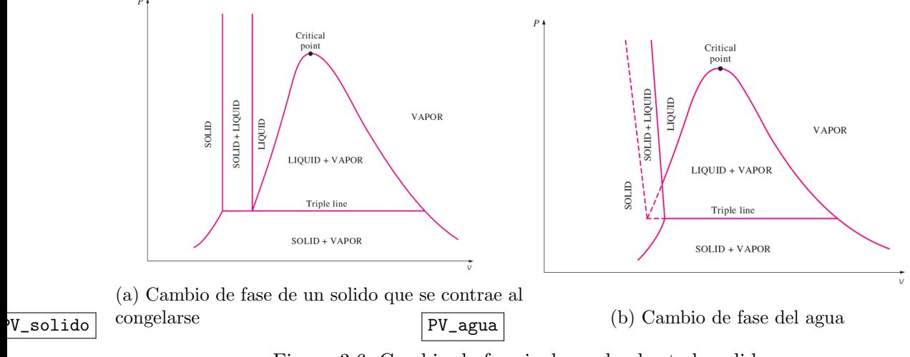
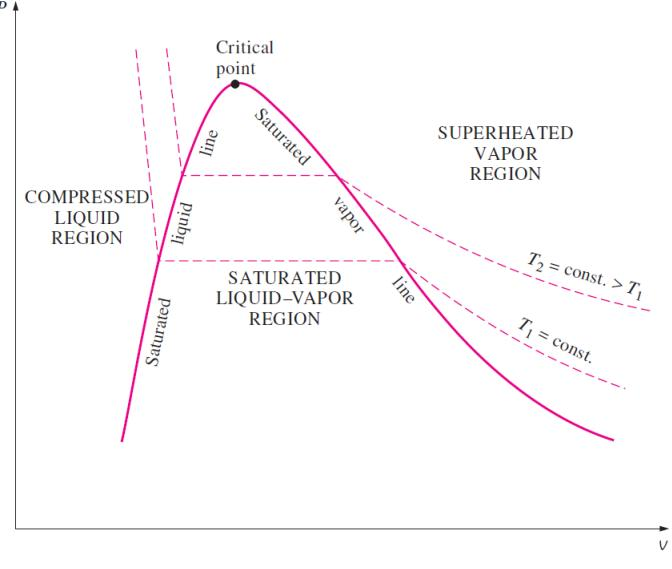

# Resumen Ayudantía 5 - Sustancias Puras y Cambios de Fase

## Introducción

Esta ayudantía se centra en las sustancias puras, cambios de fase y el uso de diagramas de fase para entender el comportamiento termodinámico de las sustancias. Estos conceptos son fundamentales para el análisis de sistemas reales de intercambio de energía.

> 💡 **Objetivo de la Ayudantía**: Comprender cómo se comportan las sustancias puras en diferentes fases y cómo utilizar diagramas de fase para determinar propiedades termodinámicas.

## 1. Sustancias Puras y Cambios de Fase

### 1.1 Definición de Sustancia Pura

```
┌──────────────────────────────┐
│ SUSTANCIA PURA               │
├──────────────────────────────┤
│ • Composición química        │
│   homogénea e invariable     │
│                              │
│ • Puede existir en           │
│   diferentes fases           │
│                              │
│ • Las propiedades varían     │
│   de forma continua dentro   │
│   de una misma fase          │
└──────────────────────────────┘
```

| Ejemplo      | Fórmula | ¿Es sustancia pura? |
| ------------ | ------- | ------------------- |
| Agua         | H₂O     | Sí                  |
| Nitrógeno    | N₂      | Sí                  |
| Aire         | -       | No (mezcla)         |
| Alcohol puro | C₂H₅OH  | Sí                  |

[→ Ver más en sustancias_puras.md](../libro/sustancias_puras.md)

### 1.2 Fases y Cambios de Fase


*Figura 1: Diagrama mostrando los cambios de fase para una sustancia que se contrae al solidificarse*

```
                     Sublimación
                   ↗           ↘
              SÓLIDO ←→ LÍQUIDO ←→ GAS
                   ↘           ↗
                  Deposición
```

| Cambio         | Dirección      | Energía | Ejemplo            |
| -------------- | -------------- | ------- | ------------------ |
| Fusión         | Sólido→Líquido | Absorbe | Hielo→Agua         |
| Solidificación | Líquido→Sólido | Libera  | Agua→Hielo         |
| Vaporización   | Líquido→Gas    | Absorbe | Agua→Vapor         |
| Condensación   | Gas→Líquido    | Libera  | Vapor→Agua         |
| Sublimación    | Sólido→Gas     | Absorbe | Hielo seco→CO₂ gas |

## 2. Diagramas de Fase

### 2.1 Diagrama P-v


*Figura 1: Diagrama P-v mostrando las diferentes regiones y el punto crítico*

```
P
│
│ Líquido     Punto crítico
│             ●
│            /│\
│ Sólido    / │ \    Vapor/Gas
│          /  │  \
│         /Región\
│        / bifásica\
└───────────────────── v
```

**Características principales**:

- En la región bifásica, la presión permanece constante durante el cambio de fase
- La línea horizontal representa estados donde coexisten líquido y vapor
- Por encima del punto crítico no hay distinción entre fases líquida y gaseosa

### 2.2 Diagrama T-v


*Figura 2: Diagrama T-v mostrando las curvas de saturación y el punto crítico*

```
T
│           Punto
│           crítico
│             ●
│            /│\
│           / │ \
│          /  │  \
│         /   │   \
│        /    │    \
└───────────────────── v
```

**Características principales**:

- Similar al diagrama P-v pero con isotermas horizontales en la región de cambio de fase
- Muestra cómo el volumen específico cambia con la temperatura
- Útil para visualizar procesos a temperatura constante

### 2.3 Diagrama P-T

```
P
│
│ Sólido
│      \     Líquido
│       \    /
│        \  /
│         \/        Gas/Vapor
│         /\
│        /  \
│       /    \
│      /      \
└───────────────── T
 Punto   Punto
 triple  crítico
```

**Características principales**:

- Muestra regiones donde cada fase es estable
- Punto triple: coexisten tres fases
- Punto crítico: final de la línea de saturación líquido-vapor

## 3. Problemas Resueltos

### Ejemplo 1: Cálculo de energía en cambio de fase

**Problema**: Calcular la energía necesaria para convertir 2 kg de hielo a -5°C en vapor a 110°C.

**Solución**:

1. **Etapas**:

   - Calentamiento del hielo de -5°C a 0°C
   - Fusión a 0°C
   - Calentamiento del agua de 0°C a 100°C
   - Vaporización a 100°C
   - Calentamiento del vapor de 100°C a 110°C

2. **Datos**:

   - m = 2 kg
   - c(hielo) = 2.1 kJ/(kg·°C)
   - c(agua) = 4.18 kJ/(kg·°C)
   - c(vapor) = 1.86 kJ/(kg·°C)
   - h(fusión) = 334 kJ/kg
   - h(vaporización) = 2257 kJ/kg

3. **Cálculos**:

   - Q₁ = m·c(hielo)·ΔT = 2 × 2.1 × 5 = 21 kJ
   - Q₂ = m·h(fusión) = 2 × 334 = 668 kJ
   - Q₃ = m·c(agua)·ΔT = 2 × 4.18 × 100 = 836 kJ
   - Q₄ = m·h(vaporización) = 2 × 2257 = 4514 kJ
   - Q₅ = m·c(vapor)·ΔT = 2 × 1.86 × 10 = 37.2 kJ

4. **Total**: Q = Q₁ + Q₂ + Q₃ + Q₄ + Q₅ = 6076.2 kJ

### Ejemplo 2: Uso de diagramas de fase

**Problema**: Una sustancia pura tiene un volumen específico de 0.25 m³/kg a 500 kPa. En estas condiciones, vf = 0.001 m³/kg y vg = 0.375 m³/kg. Determinar:
a) La fase de la sustancia
b) La calidad, si aplica
c) La temperatura, si está en la región de saturación

**Solución**:

1. Como vf < v < vg, la sustancia está en la región bifásica (mezcla líquido-vapor).
2. Calidad: x = (v - vf)/(vg - vf) = (0.25 - 0.001)/(0.375 - 0.001) = 0.666 = 66.6%
3. En la región bifásica, la temperatura es la temperatura de saturación correspondiente a 500 kPa (se debe consultar tablas).

## 4. Conceptos Clave a Recordar

- Una sustancia pura tiene composición química uniforme
- Los cambios de fase ocurren a temperatura constante (a presión constante)
- En la región bifásica, la presión y temperatura no son independientes
- La calidad (x) indica la fracción másica de vapor en una mezcla líquido-vapor
- El punto triple es donde coexisten tres fases y tiene valores únicos de P y T
- El punto crítico es donde desaparece la distinción entre líquido y gas

> ⚠️ **Para tener en cuenta**: Al resolver problemas de cambio de fase, identifica claramente las fases inicial y final, así como todas las etapas intermedias.

---

[← Índice de Contenidos](../Indice.md)
