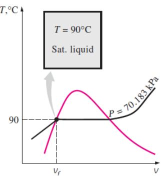

# Resumen Ayudantía 6 - Tablas de Propiedades y Gas Ideal

## Introducción

Esta ayudantía se enfoca en el uso de tablas de propiedades termodinámicas y la aplicación de la ecuación de gas ideal. Estos son herramientas fundamentales para resolver problemas prácticos de termodinámica en sistemas que involucran líquidos, vapores y gases.

> 💡 **Objetivo de la Ayudantía**: Desarrollar habilidades para usar tablas de propiedades termodinámicas y aplicar correctamente la ecuación de gas ideal en diversos problemas.

## 1. Tablas de Propiedades y Entalpía

### 1.1 Tipos de Tablas Termodinámicas


*Figura 1: Ejemplo de tablas de propiedades para sustancias puras*

```
┌─────────────────────────────┐
│ TABLAS DE PROPIEDADES       │
├─────────────────────────────┤
│ • Tablas de saturación      │
│   - Por temperatura         │
│   - Por presión             │
│                             │
│ • Tablas de vapor           │
│   sobrecalentado            │
│                             │
│ • Tablas de líquido         │
│   comprimido                │
│                             │
│ • Tablas de gas ideal       │
└─────────────────────────────┘
```

| Tipo de Tabla      | Uso                       | Propiedades Típicas                  |
| ------------------ | ------------------------- | ------------------------------------ |
| Saturación         | Estados de cambio de fase | T, P, vf, vg, uf, ug, hf, hg, sf, sg |
| Sobrecalentado     | Vapor a T > Tsat          | v, u, h, s para diversos P y T       |
| Líquido comprimido | Líquido a P > Psat        | v, u, h, s para P elevadas           |

[→ Ver más en tablas_propiedades.md](../libro/tablas_propiedades.md)

### 1.2 Entalpía y su Importancia

**Definición**: La entalpía (h) es una propiedad termodinámica definida como:

$$h = u + Pv$$

Donde:

- h = entalpía específica [kJ/kg]
- u = energía interna específica [kJ/kg]
- P = presión [kPa]
- v = volumen específico [m³/kg]

**Importancia**:

1. En procesos a presión constante: $q = \Delta h$
2. Esencial para análisis de sistemas con flujo
3. Facilita cálculos en cambios de fase

### 1.3 Determinación de Estados Termodinámicos

Para determinar completamente el estado de una sustancia pura, necesitamos conocer:

- Dos propiedades independientes
- La región en que se encuentra (líquido comprimido, mezcla, vapor sobrecalentado)

```
     Estado conocido         Propiedades necesarias
┌───────────────────────┐  ┌───────────────────────┐
│ • Región saturada     │  │ • P o T               │
│   (mezcla)           │  │ • Una propiedad más    │
│                       │  │   (x, v, u, h, s)     │
├───────────────────────┤  ├───────────────────────┤
│ • Vapor sobrecalentado│  │ • Dos propiedades     │
│   o líquido comprimido│  │   independientes      │
│                       │  │   (P, T, v, u, h, s)  │
└───────────────────────┘  └───────────────────────┘
```

## 2. Ecuación de Gas Ideal

### 2.1 Definición y Limitaciones

**Ecuación de estado**:

$$PV = nRT \quad \text{o} \quad Pv = RT$$

Donde:

- P = presión [kPa]
- V = volumen [m³]
- n = número de moles [mol]
- R = constante universal = 8.314 J/(mol·K)
- T = temperatura absoluta [K]
- v = volumen específico [m³/kg]
- R = constante particular del gas [J/(kg·K)]

**Limitaciones**:

- Mejor aproximación a bajas presiones y altas temperaturas
- Se vuelve inexacta cerca del punto crítico
- No predice cambios de fase


*Figura 2: Factor de compresibilidad que muestra la desviación del comportamiento ideal*

### 2.2 Propiedades de Gases Ideales

**Calores específicos**:

- cv = calor específico a volumen constante [J/(kg·K)]
- cp = calor específico a presión constante [J/(kg·K)]
- Relación: cp - cv = R
- γ = cp/cv (coeficiente adiabático)

**Energía interna y entalpía**:

- Para gases ideales, u = u(T) y h = h(T)
- Δu = cv·ΔT
- Δh = cp·ΔT

## 3. Problemas Resueltos

### Ejemplo 1: Uso de tablas de propiedades

**Problema**: Vapor de agua a 3 MPa tiene un volumen específico de 0.09 m³/kg. Determine:
a) La temperatura del vapor
b) La entalpía específica
c) La energía interna

**Solución**:

1. **Determinar la región**:

   - A 3 MPa, vf = 0.00143 m³/kg y vg = 0.06667 m³/kg (de tablas)
   - Como v > vg, el vapor está sobrecalentado

2. **Encontrar temperatura**:

   - De las tablas de vapor sobrecalentado a 3 MPa:
   - Interpolando entre valores para v = 0.09 m³/kg, aproximadamente T = 400°C

3. **Obtener propiedades**:
   - De tabla a 3 MPa y 400°C: h = 3230 kJ/kg, u = 2960 kJ/kg

### Ejemplo 2: Gas ideal

**Problema**: 2 kg de aire (considerado como gas ideal con R = 287 J/(kg·K)) están a 100 kPa y 27°C. Se comprimen hasta 500 kPa manteniendo la temperatura constante. Calcular:
a) El volumen inicial y final
b) El trabajo realizado durante la compresión

**Solución**:

1. **Datos**:

   - m = 2 kg
   - R = 287 J/(kg·K)
   - T = 27°C = 300 K
   - P₁ = 100 kPa, P₂ = 500 kPa
   - Proceso isotérmico (T = constante)

2. **Volúmenes**:

   - V₁ = mRT/P₁ = 2 × 287 × 300 / 100,000 = 1.722 m³
   - V₂ = mRT/P₂ = 2 × 287 × 300 / 500,000 = 0.3444 m³

3. **Trabajo**:
   - W = P₁V₁ln(V₂/V₁) = 100,000 × 1.722 × ln(0.3444/1.722) = -282,030 J = -282 kJ
   - El signo negativo indica trabajo realizado sobre el gas (compresión)

## 4. Factor de Compresibilidad Z

### 4.1 Definición y Uso

El factor de compresibilidad (Z) es una medida de la desviación del comportamiento de un gas real respecto al ideal:

$$Z = \frac{Pv}{RT}$$

- Z = 1: comportamiento de gas ideal
- Z < 1: generalmente debido a fuerzas de atracción dominantes
- Z > 1: generalmente debido a fuerzas repulsivas dominantes

### 4.2 Propiedades Reducidas

El principio de estados correspondientes permite usar un gráfico generalizado de Z usando propiedades reducidas:

- Temperatura reducida: Tr = T/Tc
- Presión reducida: Pr = P/Pc

Donde Tc y Pc son la temperatura y presión críticas del gas.

## 5. Conceptos Clave a Recordar

- Para determinar un estado se necesitan dos propiedades independientes
- En la región de saturación, la presión y temperatura no son independientes entre sí
- La calidad (x) solo es aplicable en la región de saturación
- Para gas ideal, PV = nRT es válido con buena aproximación a bajas presiones
- Los calores específicos relacionan el cambio de temperatura con transferencia de calor
- El factor Z permite corregir la ecuación de gas ideal para gases reales

> ⚠️ **Para tener en cuenta**: Al usar tablas, identifique primero la región en la que se encuentra la sustancia, y luego seleccione las tablas correspondientes.

---

[← Índice de Contenidos](../Indice.md)
