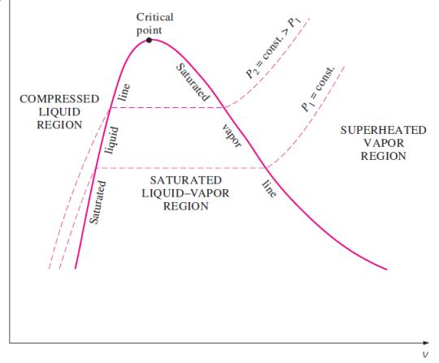
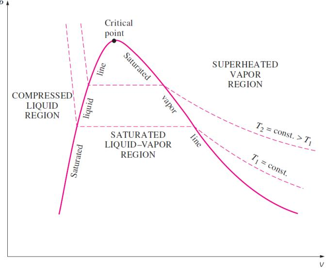
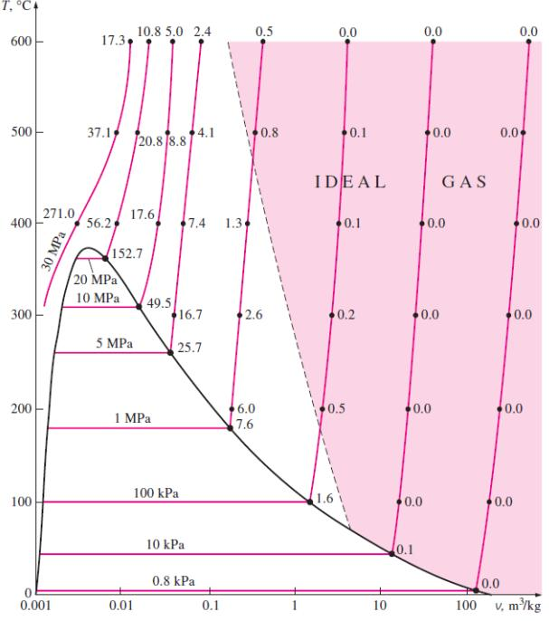
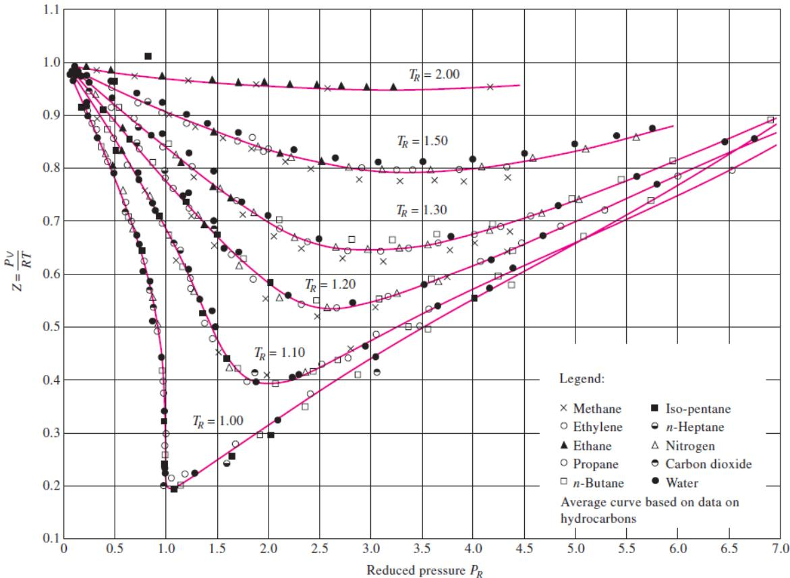

# Resumen Ayudantía 8 - Repaso I2

## Introducción

Esta ayudantía constituye un repaso integral de los temas abordados en la segunda parte del curso FIS1523 - Termodinámica, preparando a los estudiantes para la Interrogación 2. Se revisarán conceptos clave, relaciones fundamentales y estrategias para resolver problemas típicos.

> 💡 **Objetivo de la Ayudantía**: Consolidar los conocimientos adquiridos en todos los temas de la Interrogación 2 y desarrollar habilidades para la resolución efectiva de problemas complejos.

## 1. Sustancias Puras y Propiedades

### 1.1 Definiciones Clave

```
┌─────────────────────────────┐
│ SUSTANCIA PURA              │
├─────────────────────────────┤
│ • Composición química       │
│   homogénea e invariable    │
│                             │
│ • Estados:                  │
│   - Líquido                 │
│   - Vapor                   │
│   - Mezcla bifásica         │
│     x = mvapor/mtotal       │
└─────────────────────────────┘
```

### 1.2 Diagramas de Fase


*Figura 1.1: Diagrama T-v para una sustancia pura mostrando el punto crítico y la curva de saturación*


*Figura 1.2: Diagrama P-v para una sustancia pura*

| Diagrama | Características                | Utilidad                         |
| -------- | ------------------------------ | -------------------------------- |
| P-v      | Isotermas, curva de saturación | Análisis de trabajo y expansión  |
| T-v      | Isobaras, región de saturación | Visualización de cambios de fase |
| P-T      | Punto triple, punto crítico    | Identificación de fases          |

> 🔍 **Recuerda**: El punto crítico marca el fin de la distinción entre líquido y vapor. El punto triple es donde coexisten las tres fases.

### 1.3 Tablas de Propiedades

```
┌─────────────────────────────┐
│ TABLAS DE PROPIEDADES       │
├─────────────────────────────┤
│ • Saturación                │
│   - Por temperatura         │
│   - Por presión             │
│                             │
│ • Vapor sobrecalentado      │
│                             │
│ • Líquido comprimido        │
└─────────────────────────────┘
```

#### Propiedades en región bifásica:

- v = vf + x(vg - vf)
- u = uf + x(ug - uf)
- h = hf + x(hg - hf)
- s = sf + x(sg - sf)

[→ Ver más en sustancias_puras.md](../libro/sustancias_puras.md)

## 2. Gas Ideal y Factor de Compresibilidad

### 2.1 Ecuación de Gas Ideal

```
┌─────────────────────────────┐
│ GAS IDEAL                   │
├─────────────────────────────┤
│ • PV = nRT                  │
│ • P = ρRT                   │
│                             │
│ • Calores específicos:      │
│   - cp - cv = R             │
│   - γ = cp/cv               │
└─────────────────────────────┘
```

### 2.2 Factor de Compresibilidad


*Figura 2: Gráfico del factor de compresibilidad para diferentes gases*

```
    Z = PV/RT
    │
    │         Z > 1
    │       /
  1 │-----/------
    │     |
    │     |
    │     \
    │      \ Z < 1
    │       \
    │        \
    │     └───────┘
    │
    └───────────────── Pr
```

- Z = PV/RT (mide desviación del comportamiento ideal)
- Z > 1: Repulsión molecular domina
- Z < 1: Atracción molecular domina
- Principio de estados correspondientes: Z = f(Pr, Tr)

[→ Ver más en compresibilidad.md](../libro/compresibilidad.md)

## 3. Análisis de Sistemas Cerrados

### 3.1 Primera Ley de la Termodinámica

```
┌─────────────────────────────┐
│ PRIMERA LEY                 │
├─────────────────────────────┤
│ • ΔU = Q - W                │
│                             │
│ • Q > 0: calor hacia        │
│   el sistema                │
│                             │
│ • W > 0: trabajo del        │
│   sistema hacia el entorno  │
└─────────────────────────────┘
```

### 3.2 Procesos Termodinámicos


*Figura 3: Representación de diferentes procesos termodinámicos en un diagrama P-V*

| Proceso    | Característica | Ecuación           | Trabajo           |
| ---------- | -------------- | ------------------ | ----------------- |
| Isocórico  | V = constante  | Q = ΔU = mcv·ΔT    | W = 0             |
| Isobárico  | P = constante  | Q = ΔH = mcp·ΔT    | W = P·ΔV          |
| Isotérmico | T = constante  | ΔU = 0 (gas ideal) | W = nRT·ln(V1/V2) |
| Adiabático | Q = 0          | ΔU = -W            | W = mcv·(T1 - T2) |

[→ Ver más en primera_ley_i2.md](../libro/primera_ley_i2.md)

## 4. Proceso Adiabático en Gas Ideal

### 4.1 Características del Proceso Adiabático

```
┌─────────────────────────────┐
│ PROCESO ADIABÁTICO (Q = 0)  │
├─────────────────────────────┤
│ • PV^γ = constante          │
│ • TV^(γ-1) = constante      │
│ • T·P^((1-γ)/γ) = constante │
│                             │
│ • γ = cp/cv                 │
│   - Monoatómico: 5/3        │
│   - Diatómico: 7/5=1.4      │
│   - Poliatómico: 4/3        │
└─────────────────────────────┘
```

### 4.2 Trabajo y Energía

```
P
│
│     Adiabático:
│      PV^γ = cte
│      ────────
│          │
│          │     Isotérmico:
│          │      PV = cte
│          │      ────────
└──────────────────────── V
```

- Trabajo adiabático: W = [P1V1 - P2V2]/(γ-1)
- Cambio de energía interna: ΔU = mcv(T2-T1)
- Relaciones: T2/T1 = (V1/V2)^(γ-1) = (P2/P1)^((γ-1)/γ)

[→ Ver más en proceso_adiabatico.md](../libro/proceso_adiabatico.md)

## 5. Ejemplos Tipo Prueba

### Ejemplo 1: Sustancias Puras

**Problema**: Agua a 500 kPa tiene un volumen específico de 0.375 m³/kg. Determine:
a) El estado y fase del agua
b) Su temperatura
c) Su entalpía y entropía

**Solución**:

1. **Determinar estado**:

   - En tablas de saturación a 500 kPa: Tsat = 151.86°C, vf = 0.001093 m³/kg, vg = 0.3749 m³/kg
   - Como v = 0.375 m³/kg ≈ vg, el agua está en estado de vapor saturado (ligeramente sobrecalentado)

2. **Temperatura**:

   - T ≈ 151.9°C (temperatura de saturación a 500 kPa)

3. **Entalpía y entropía**:
   - De las tablas: h ≈ 2749 kJ/kg, s ≈ 6.82 kJ/kg·K

### Ejemplo 2: Gas Ideal y Factor de Compresibilidad

**Problema**: Metano a 10 MPa y 300 K tiene un factor de compresibilidad Z = 0.83. Calcule:
a) El volumen específico real
b) El volumen específico si fuera gas ideal
c) El error porcentual al usar la ecuación de gas ideal

**Solución**:

1. **Volumen específico real**:

   - v = ZRT/P
   - v = 0.83 × 0.5183 × 300 / (10 × 10³)
   - v = 0.01289 m³/kg

2. **Volumen específico como gas ideal**:

   - videal = RT/P = 0.5183 × 300 / (10 × 10³) = 0.01555 m³/kg

3. **Error porcentual**:
   - Error = |(videal - vreal)/vreal| × 100%
   - Error = |(0.01555 - 0.01289)/0.01289| × 100% = 20.6%

### Ejemplo 3: Primera Ley y Procesos

**Problema**: Un sistema cerrado con 2 kg de aire (cp = 1.005 kJ/kg·K, cv = 0.718 kJ/kg·K) inicialmente a 100 kPa y 300 K, experimenta los siguientes procesos:
1-2: Compresión isotérmica hasta P2 = 300 kPa
2-3: Calentamiento isobárico hasta V3 = V1
Calcule el trabajo total, calor total y cambios de temperatura.

**Solución**:

1. **Proceso 1-2 (Isotérmico)**:

   - T1 = T2 = 300 K
   - V2 = V1 × (P1/P2) = V1 × (100/300) = V1/3
   - W12 = -P1V1ln(V2/V1) = -P1V1ln(1/3) = -P1V1 × 1.099
   - W12 = -100 × 103 × (2 × 0.287 × 300/100 × 103) × 1.099
   - W12 = -189 kJ
   - ΔU12 = 0 (isotérmico)
   - Q12 = W12 = -189 kJ

2. **Proceso 2-3 (Isobárico)**:

   - P2 = P3 = 300 kPa
   - V3 = V1 = 3V2
   - T3/T2 = V3/V2 = 3
   - T3 = 3 × 300 = 900 K
   - ΔU23 = mcv(T3-T2) = 2 × 0.718 × (900-300) = 860 kJ
   - W23 = P(V3-V2) = 300 × 103 × 2 × 0.287 × (900-300)/300 × 103 = 344 kJ
   - Q23 = ΔU23 + W23 = 860 + 344 = 1204 kJ

3. **Totales**:
   - Wtotal = W12 + W23 = -189 + 344 = 155 kJ
   - Qtotal = Q12 + Q23 = -189 + 1204 = 1015 kJ

### Ejemplo 4: Proceso Adiabático

**Problema**: Un gas diatómico (γ = 1.4) con presión inicial 200 kPa, temperatura 27°C y volumen 0.1 m³, se comprime adiabáticamente hasta un volumen de 0.02 m³. Calcule:
a) La presión y temperatura finales
b) El trabajo realizado sobre el gas

**Solución**:

1. **Datos**:

   - γ = 1.4
   - P1 = 200 kPa
   - T1 = 300 K
   - V1 = 0.1 m³
   - V2 = 0.02 m³

2. **Presión final** (usando P1V1^γ = P2V2^γ):

   - P2 = P1(V1/V2)^γ = 200 × (0.1/0.02)^1.4
   - P2 = 200 × 5^1.4 = 200 × 9.64 = 1928 kPa

3. **Temperatura final** (usando T1V1^(γ-1) = T2V2^(γ-1)):

   - T2 = T1(V1/V2)^(γ-1) = 300 × (0.1/0.02)^0.4
   - T2 = 300 × 5^0.4 = 300 × 1.93 = 579 K

4. **Trabajo** (W = [P1V1-P2V2]/(γ-1)):
   - W = [200×10³×0.1 - 1928×10³×0.02]/(1.4-1)
   - W = [20,000 - 38,560]/0.4 = -46,400 J = -46.4 kJ
   - El trabajo es realizado sobre el gas

## 6. Errores Comunes a Evitar

1. **Unidades**:

   - Asegúrate de usar unidades coherentes (SI preferentemente)
   - Convierte kPa a Pa multiplicando por 1000
   - Convierte °C a K sumando 273.15

2. **Tablas de propiedades**:

   - Identifica correctamente la fase y región (subenfriado, saturación, sobrecalentado)
   - Interpola cuando sea necesario para mayor precisión
   - Verifica que estás consultando la tabla correcta (por presión o por temperatura)

3. **Procesos**:

   - No confundir las ecuaciones específicas de cada proceso
   - Recordar que PV = constante solo aplica a procesos isotérmicos de gases ideales
   - Para procesos adiabáticos, usar PV^γ = constante

4. **Convención de signos**:
   - Mantener consistencia: W > 0 trabajo del sistema, Q > 0 calor hacia el sistema
   - Verificar el signo final: compresión generalmente implica trabajo sobre el sistema (W < 0)

## 7. Tips para la Interrogación 2

1. **Antes del Examen**:

   - Repasar todas las fórmulas clave (ver formulario)
   - Practicar con problemas de ayudantías anteriores
   - Familiarizarse con el uso eficiente de tablas de propiedades

2. **Durante el Examen**:

   - Leer completamente cada problema antes de comenzar
   - Identificar el tipo de proceso y sistema involucrado
   - Hacer diagramas para visualizar los procesos
   - Verificar unidades y magnitudes de los resultados

3. **Estrategia de Resolución**:
   - Identificar los estados inicial y final
   - Determinar propiedades conocidas en cada estado
   - Seleccionar las ecuaciones apropiadas según el tipo de proceso
   - Resolver paso a paso y verificar consistencia

## Referencias y Material de Estudio

- 📚 [Temario Completo I2](../../Materiales/Temario%20I2.md)
- 📝 [Formulario del curso](../formulario/formulario_i2.md)
- 🔗 Resúmenes de ayudantías anteriores:
  - [Ayudantía 5](resumen_ayudantia_5.md)
  - [Ayudantía 6](resumen_ayudantia_6.md)
  - [Ayudantía 7](resumen_ayudantia_7.md)

## Ejercicios Propuestos

1. Vapor de agua a 2 MPa y 350°C se expande isotérmicamente hasta 0.5 MPa. Calcular el trabajo específico y el calor específico transferido.

2. Un cilindro con pistón contiene nitrógeno (γ = 1.4) a 20°C y 1 bar. El gas se comprime hasta un tercio de su volumen original siguiendo un proceso politrópico con n = 1.25. Determinar la presión final, temperatura final y trabajo realizado.

3. Refrigerante R-134a inicialmente como vapor saturado a -10°C se comprime hasta 1 MPa, 50°C. Determine el cambio de entalpía, energía interna y entropía utilizando tablas de propiedades.
